# Activity Diagram List

## Owner Activities
- Owner sign in and dashboard access
- Owner dashboard review and report export
- Booking approval and rejection
- Customer verification management
- Fleet search, filter, and service action
- Maintenance scheduling and service recording
- Payment verification
- Notification triage
- Reports and analytics review
- Decision support actions
- Branch management
- Users and roles management
- Settings management

## Staff Activities
- Staff sign in and restricted access
- Staff booking queue management
- Staff calendar review

## Customer Activities
- Customer registration
- Customer sign in
- Customer vehicle search
- Browse vehicles and reserve
- Booking request
- Requirement submission
- Payment proof submission
- Customer dashboard tracking
- Contact inquiry

## Shared or Cross-Role Activities
- Session and role authorization
- OAuth sign in or sign up
- Logout
- Error and not found recovery

# Assumptions

- Owner maps to the visible Business Owner role.
- Staff is limited to the operational modules visible in the UI: bookings and calendar.
- Customer account creation, booking requests, uploads, approvals, payments, exports, and settings changes are treated as full-system workflows because the UI presents them as actions.
- Some UI actions do not expose full implementation details. Those flows include an assumption note in the diagram.
- Mermaid subgraphs are used as swimlanes because Mermaid does not provide native UML activity partitions.

# Mermaid Diagrams

## Mermaid Style Pattern

Each diagram uses the same class pattern:

- Blue nodes: user actions
- Green nodes: system actions
- Purple nodes: decision points
- Red nodes: error or rejection paths
- Orange circles: start and end nodes

## Owner Sign In and Dashboard Access

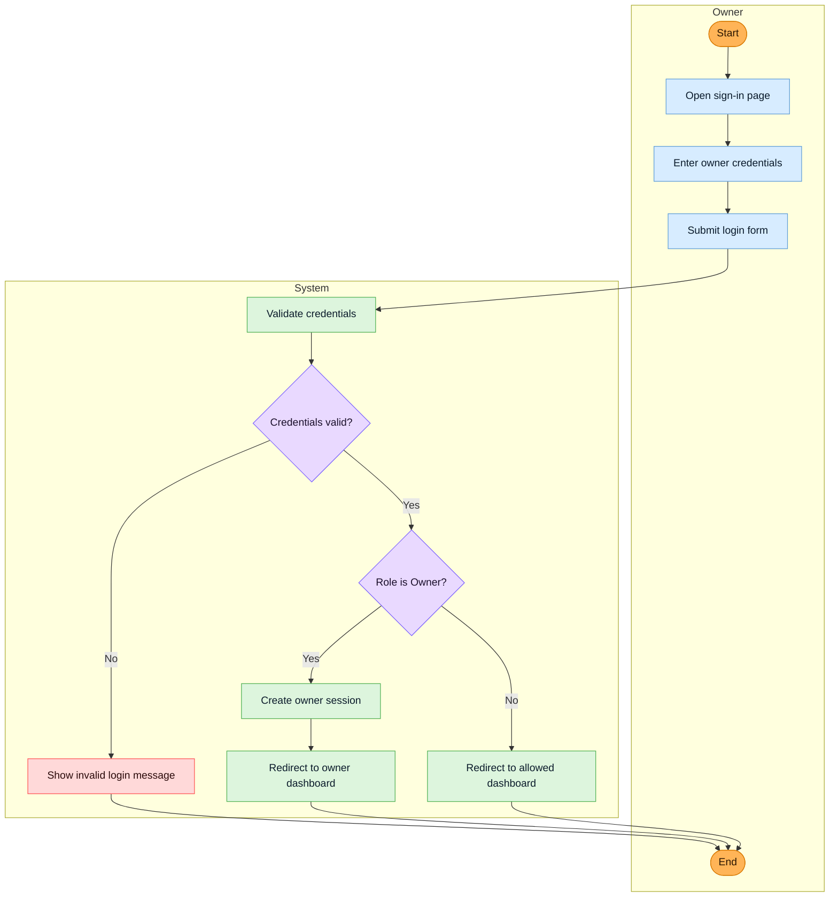
```mermaid
flowchart TD
  subgraph Owner["Owner"]
    direction TB
    A([Start])
    B[Open sign-in page]
    C[Enter owner credentials]
    D[Submit login form]
    Z([End])
  end

  subgraph System["System"]
    direction TB
    E[Validate credentials]
    F{Credentials valid?}
    G{Role is Owner?}
    H[Create owner session]
    I[Redirect to owner dashboard]
    J[Show invalid login message]
    K[Redirect to allowed dashboard]
  end

  A --> B --> C --> D --> E --> F
  F -- Yes --> G
  F -- No --> J --> Z
  G -- Yes --> H --> I --> Z
  G -- No --> K --> Z

  classDef user fill:#D7ECFF,stroke:#5B9BD5,color:#0B1B2B;
  classDef system fill:#DDF5DD,stroke:#4CAF50,color:#0B1B2B;
  classDef decision fill:#E9D9FF,stroke:#7B61FF,color:#1B102B;
  classDef error fill:#FFD9D9,stroke:#FF4D4F,color:#2B0B0B;
  classDef terminal fill:#FFB457,stroke:#D87900,color:#2B1600;
  class A,Z terminal;
  class B,C,D user;
  class E,H,I,K system;
  class F,G decision;
  class J error;
```

## Owner Dashboard Review and Report Export

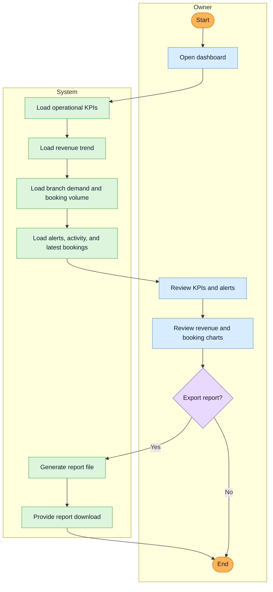
```mermaid
flowchart TD
  subgraph Owner["Owner"]
    direction TB
    A([Start])
    B[Open dashboard]
    C[Review KPIs and alerts]
    D[Review revenue and booking charts]
    E{Export report?}
    Z([End])
  end

  subgraph System["System"]
    direction TB
    F[Load operational KPIs]
    G[Load revenue trend]
    H[Load branch demand and booking volume]
    I[Load alerts, activity, and latest bookings]
    J[Generate report file]
    K[Provide report download]
  end

  A --> B --> F --> G --> H --> I --> C --> D --> E
  E -- Yes --> J --> K --> Z
  E -- No --> Z

  classDef user fill:#D7ECFF,stroke:#5B9BD5,color:#0B1B2B;
  classDef system fill:#DDF5DD,stroke:#4CAF50,color:#0B1B2B;
  classDef decision fill:#E9D9FF,stroke:#7B61FF,color:#1B102B;
  classDef terminal fill:#FFB457,stroke:#D87900,color:#2B1600;
  class A,Z terminal;
  class B,C,D user;
  class F,G,H,I,J,K system;
  class E decision;
```

## Booking Approval and Rejection

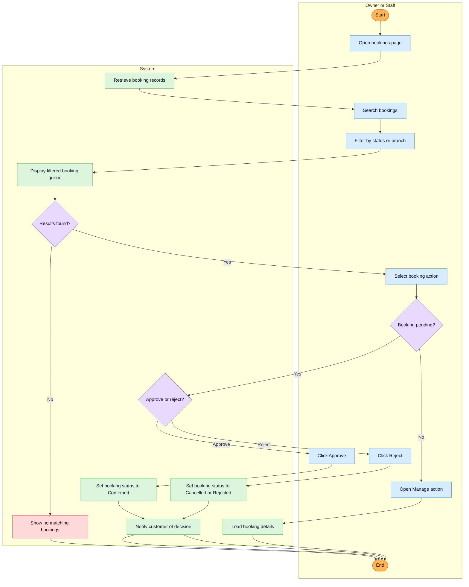
```mermaid
flowchart TD
  subgraph OwnerOrStaff["Owner or Staff"]
    direction TB
    A([Start])
    B[Open bookings page]
    C[Search bookings]
    D[Filter by status or branch]
    E[Select booking action]
    F{Booking pending?}
    G[Click Approve]
    H[Click Reject]
    I[Open Manage action]
    Z([End])
  end

  subgraph System["System"]
    direction TB
    J[Retrieve booking records]
    K[Display filtered booking queue]
    L{Approve or reject?}
    M[Set booking status to Confirmed]
    N[Set booking status to Cancelled or Rejected]
    O[Notify customer of decision]
    P[Load booking details]
    Q[Show no matching bookings]
    R{Results found?}
  end

  A --> B --> J --> C --> D --> K
  K --> R{Results found?}
  R -- No --> Q --> Z
  R -- Yes --> E --> F
  F -- Yes --> L
  L -- Approve --> G --> M --> O --> Z
  L -- Reject --> H --> N --> O --> Z
  F -- No --> I --> P --> Z

  classDef user fill:#D7ECFF,stroke:#5B9BD5,color:#0B1B2B;
  classDef system fill:#DDF5DD,stroke:#4CAF50,color:#0B1B2B;
  classDef decision fill:#E9D9FF,stroke:#7B61FF,color:#1B102B;
  classDef error fill:#FFD9D9,stroke:#FF4D4F,color:#2B0B0B;
  classDef terminal fill:#FFB457,stroke:#D87900,color:#2B1600;
  class A,Z terminal;
  class B,C,D,E,G,H,I user;
  class J,K,M,N,O,P system;
  class F,L,R decision;
  class Q error;
```

## Customer Verification Management

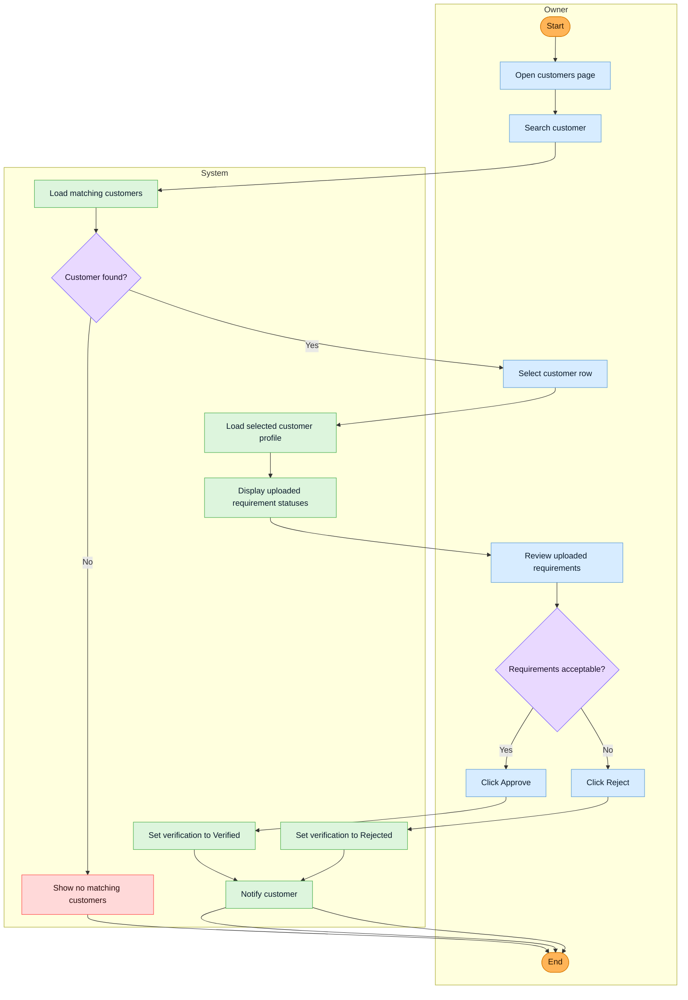
```mermaid
flowchart TD
  subgraph Owner["Owner"]
    direction TB
    A([Start])
    B[Open customers page]
    C[Search customer]
    D[Select customer row]
    E[Review uploaded requirements]
    F{Requirements acceptable?}
    G[Click Approve]
    H[Click Reject]
    Z([End])
  end

  subgraph System["System"]
    direction TB
    I[Load matching customers]
    J[Load selected customer profile]
    K[Display uploaded requirement statuses]
    L[Set verification to Verified]
    M[Set verification to Rejected]
    N[Notify customer]
    O[Show no matching customers]
    P{Customer found?}
  end

  A --> B --> C --> I --> P{Customer found?}
  P -- No --> O --> Z
  P -- Yes --> D --> J --> K --> E --> F
  F -- Yes --> G --> L --> N --> Z
  F -- No --> H --> M --> N --> Z

  classDef user fill:#D7ECFF,stroke:#5B9BD5,color:#0B1B2B;
  classDef system fill:#DDF5DD,stroke:#4CAF50,color:#0B1B2B;
  classDef decision fill:#E9D9FF,stroke:#7B61FF,color:#1B102B;
  classDef error fill:#FFD9D9,stroke:#FF4D4F,color:#2B0B0B;
  classDef terminal fill:#FFB457,stroke:#D87900,color:#2B1600;
  class A,Z terminal;
  class B,C,D,E,G,H user;
  class I,J,K,L,M,N system;
  class F,P decision;
  class O error;
```

## Fleet Search, Filter, and Service Action

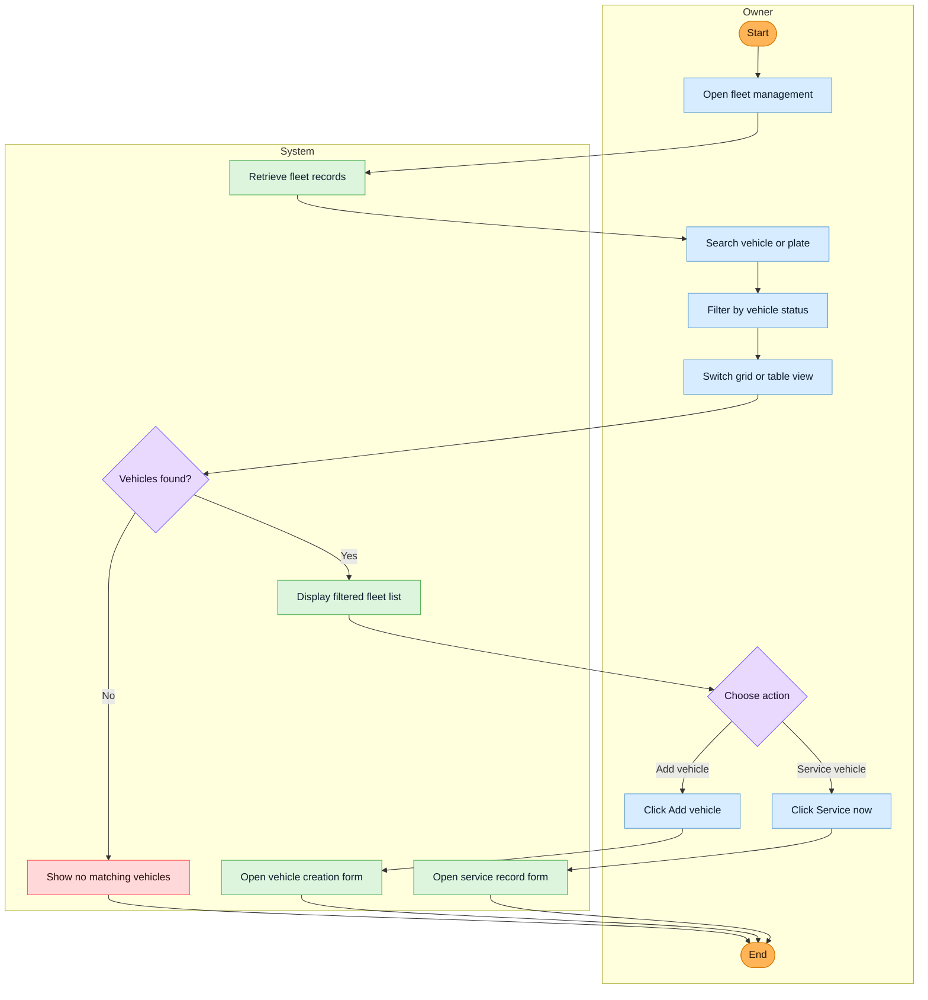
```mermaid
flowchart TD
  subgraph Owner["Owner"]
    direction TB
    A([Start])
    B[Open fleet management]
    C[Search vehicle or plate]
    D[Filter by vehicle status]
    E[Switch grid or table view]
    F{Choose action}
    G[Click Add vehicle]
    H[Click Service now]
    Z([End])
  end

  subgraph System["System"]
    direction TB
    I[Retrieve fleet records]
    J[Display filtered fleet list]
    K[Open vehicle creation form]
    L[Open service record form]
    M[Show no matching vehicles]
    N{Vehicles found?}
  end

  A --> B --> I --> C --> D --> E --> N{Vehicles found?}
  N -- No --> M --> Z
  N -- Yes --> J --> F
  F -- Add vehicle --> G --> K --> Z
  F -- Service vehicle --> H --> L --> Z

  classDef user fill:#D7ECFF,stroke:#5B9BD5,color:#0B1B2B;
  classDef system fill:#DDF5DD,stroke:#4CAF50,color:#0B1B2B;
  classDef decision fill:#E9D9FF,stroke:#7B61FF,color:#1B102B;
  classDef error fill:#FFD9D9,stroke:#FF4D4F,color:#2B0B0B;
  classDef terminal fill:#FFB457,stroke:#D87900,color:#2B1600;
  class A,Z terminal;
  class B,C,D,E,G,H user;
  class I,J,K,L system;
  class F,N decision;
  class M error;
```

## Maintenance Scheduling and Service Recording

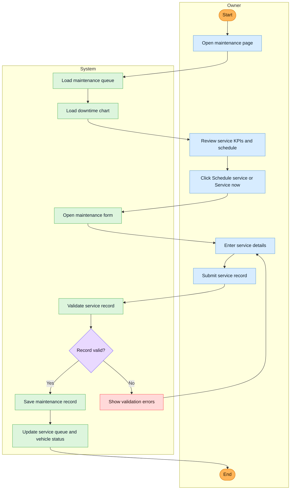
```mermaid
flowchart TD
  subgraph Owner["Owner"]
    direction TB
    A([Start])
    B[Open maintenance page]
    C[Review service KPIs and schedule]
    D[Click Schedule service or Service now]
    E[Enter service details]
    F[Submit service record]
    Z([End])
  end

  subgraph System["System"]
    direction TB
    G[Load maintenance queue]
    H[Load downtime chart]
    I[Open maintenance form]
    J[Validate service record]
    K{Record valid?}
    L[Save maintenance record]
    M[Update service queue and vehicle status]
    N[Show validation errors]
  end

  A --> B --> G --> H --> C --> D --> I --> E --> F --> J --> K
  K -- Yes --> L --> M --> Z
  K -- No --> N --> E

  classDef user fill:#D7ECFF,stroke:#5B9BD5,color:#0B1B2B;
  classDef system fill:#DDF5DD,stroke:#4CAF50,color:#0B1B2B;
  classDef decision fill:#E9D9FF,stroke:#7B61FF,color:#1B102B;
  classDef error fill:#FFD9D9,stroke:#FF4D4F,color:#2B0B0B;
  classDef terminal fill:#FFB457,stroke:#D87900,color:#2B1600;
  class A,Z terminal;
  class B,C,D,E,F user;
  class G,H,I,J,L,M system;
  class K decision;
  class N error;
```

## Payment Verification

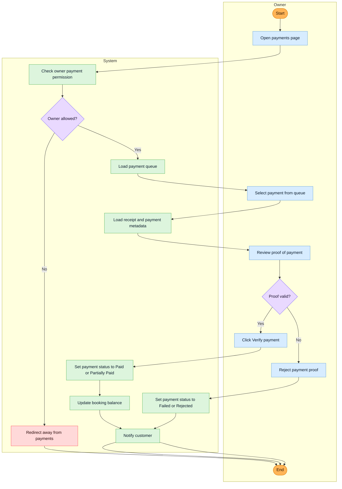
```mermaid
flowchart TD
  subgraph Owner["Owner"]
    direction TB
    A([Start])
    B[Open payments page]
    C[Select payment from queue]
    D[Review proof of payment]
    E{Proof valid?}
    F[Click Verify payment]
    G[Reject payment proof]
    Z([End])
  end

  subgraph System["System"]
    direction TB
    H[Check owner payment permission]
    I{Owner allowed?}
    J[Load payment queue]
    K[Load receipt and payment metadata]
    L[Set payment status to Paid or Partially Paid]
    M[Update booking balance]
    N[Set payment status to Failed or Rejected]
    O[Notify customer]
    P[Redirect away from payments]
  end

  A --> B --> H --> I
  I -- No --> P --> Z
  I -- Yes --> J --> C --> K --> D --> E
  E -- Yes --> F --> L --> M --> O --> Z
  E -- No --> G --> N --> O --> Z

  classDef user fill:#D7ECFF,stroke:#5B9BD5,color:#0B1B2B;
  classDef system fill:#DDF5DD,stroke:#4CAF50,color:#0B1B2B;
  classDef decision fill:#E9D9FF,stroke:#7B61FF,color:#1B102B;
  classDef error fill:#FFD9D9,stroke:#FF4D4F,color:#2B0B0B;
  classDef terminal fill:#FFB457,stroke:#D87900,color:#2B1600;
  class A,Z terminal;
  class B,C,D,F,G user;
  class H,J,K,L,M,N,O system;
  class E,I decision;
  class P error;
```

## Notification Triage

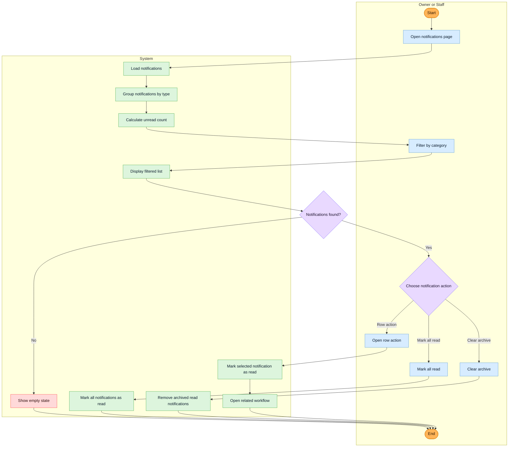
```mermaid
flowchart TD
  subgraph OwnerOrStaff["Owner or Staff"]
    direction TB
    A([Start])
    B[Open notifications page]
    C[Filter by category]
    D{Choose notification action}
    E[Mark all read]
    F[Clear archive]
    G[Open row action]
    Z([End])
  end

  subgraph System["System"]
    direction TB
    H[Load notifications]
    I[Group notifications by type]
    J[Calculate unread count]
    K[Display filtered list]
    L[Mark all notifications as read]
    M[Remove archived read notifications]
    N[Mark selected notification as read]
    O[Open related workflow]
    P[Show empty state]
  end

  A --> B --> H --> I --> J --> C --> K --> Q{Notifications found?}
  Q -- No --> P --> Z
  Q -- Yes --> D
  D -- Mark all read --> E --> L --> Z
  D -- Clear archive --> F --> M --> Z
  D -- Row action --> G --> N --> O --> Z

  classDef user fill:#D7ECFF,stroke:#5B9BD5,color:#0B1B2B;
  classDef system fill:#DDF5DD,stroke:#4CAF50,color:#0B1B2B;
  classDef decision fill:#E9D9FF,stroke:#7B61FF,color:#1B102B;
  classDef error fill:#FFD9D9,stroke:#FF4D4F,color:#2B0B0B;
  classDef terminal fill:#FFB457,stroke:#D87900,color:#2B1600;
  class A,Z terminal;
  class B,C,E,F,G user;
  class H,I,J,K,L,M,N,O system;
  class D,Q decision;
  class P error;
```

## Reports and Analytics Review

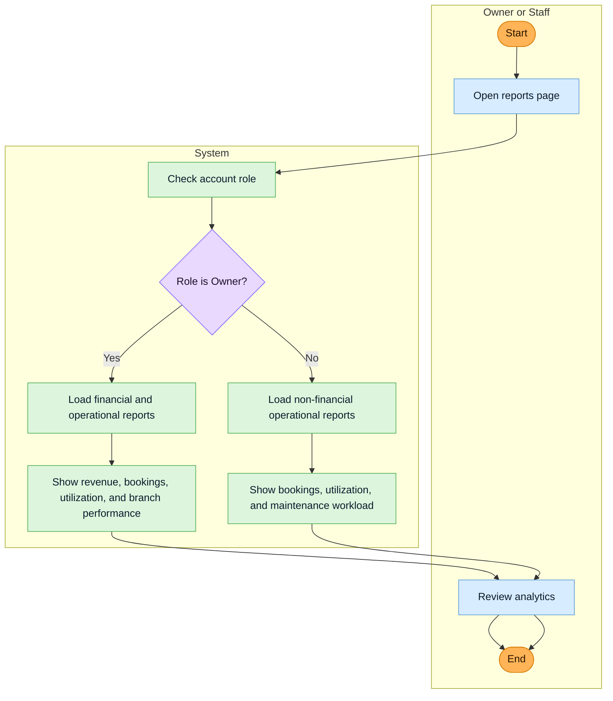
```mermaid
flowchart TD
  subgraph OwnerOrStaff["Owner or Staff"]
    direction TB
    A([Start])
    B[Open reports page]
    C[Review analytics]
    Z([End])
  end

  subgraph System["System"]
    direction TB
    D[Check account role]
    E{Role is Owner?}
    F[Load financial and operational reports]
    G[Show revenue, bookings, utilization, and branch performance]
    H[Load non-financial operational reports]
    I[Show bookings, utilization, and maintenance workload]
  end

  A --> B --> D --> E
  E -- Yes --> F --> G --> C --> Z
  E -- No --> H --> I --> C --> Z

  classDef user fill:#D7ECFF,stroke:#5B9BD5,color:#0B1B2B;
  classDef system fill:#DDF5DD,stroke:#4CAF50,color:#0B1B2B;
  classDef decision fill:#E9D9FF,stroke:#7B61FF,color:#1B102B;
  classDef terminal fill:#FFB457,stroke:#D87900,color:#2B1600;
  class A,Z terminal;
  class B,C user;
  class D,F,G,H,I system;
  class E decision;
```

## Decision Support Actions

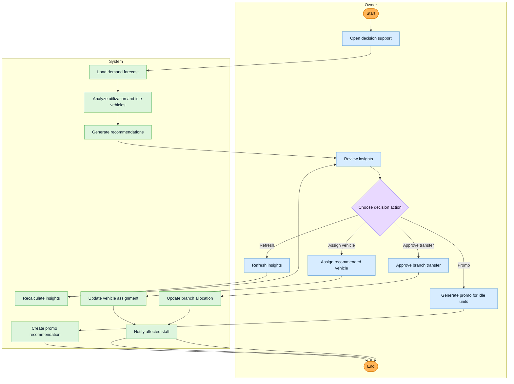
```mermaid
flowchart TD
  subgraph Owner["Owner"]
    direction TB
    A([Start])
    B[Open decision support]
    C[Review insights]
    D{Choose decision action}
    E[Refresh insights]
    F[Generate promo for idle units]
    G[Assign recommended vehicle]
    H[Approve branch transfer]
    Z([End])
  end

  subgraph System["System"]
    direction TB
    I[Load demand forecast]
    J[Analyze utilization and idle vehicles]
    K[Generate recommendations]
    L[Recalculate insights]
    M[Create promo recommendation]
    N[Update vehicle assignment]
    O[Update branch allocation]
    P[Notify affected staff]
  end

  A --> B --> I --> J --> K --> C --> D
  D -- Refresh --> E --> L --> C
  D -- Promo --> F --> M --> Z
  D -- Assign vehicle --> G --> N --> P --> Z
  D -- Approve transfer --> H --> O --> P --> Z

  classDef user fill:#D7ECFF,stroke:#5B9BD5,color:#0B1B2B;
  classDef system fill:#DDF5DD,stroke:#4CAF50,color:#0B1B2B;
  classDef decision fill:#E9D9FF,stroke:#7B61FF,color:#1B102B;
  classDef terminal fill:#FFB457,stroke:#D87900,color:#2B1600;
  class A,Z terminal;
  class B,C,E,F,G,H user;
  class I,J,K,L,M,N,O,P system;
  class D decision;
```

## Branch Management

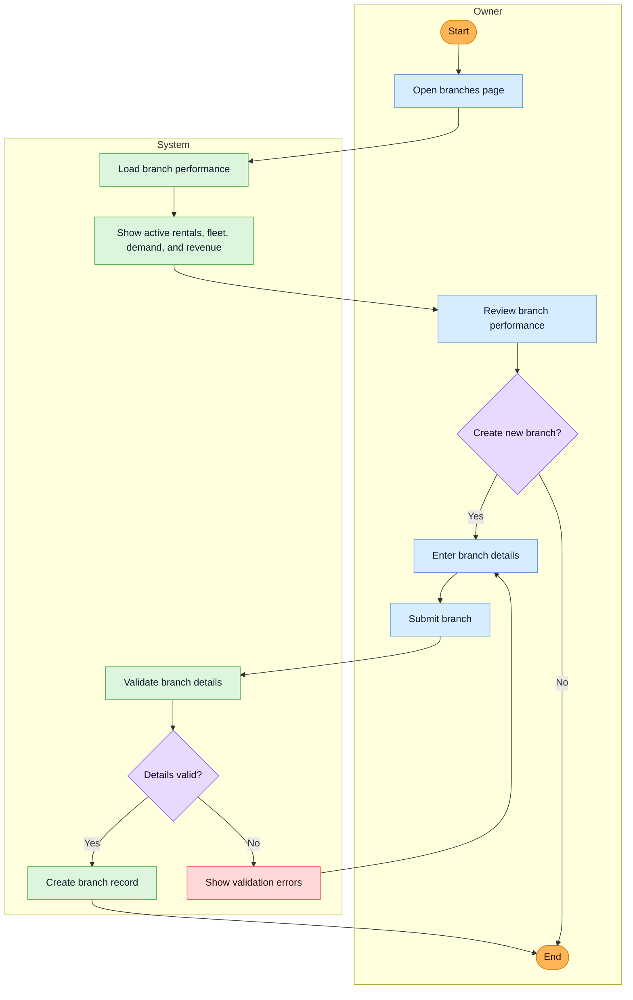
```mermaid
flowchart TD
  subgraph Owner["Owner"]
    direction TB
    A([Start])
    B[Open branches page]
    C[Review branch performance]
    D{Create new branch?}
    E[Enter branch details]
    F[Submit branch]
    Z([End])
  end

  subgraph System["System"]
    direction TB
    G[Load branch performance]
    H[Show active rentals, fleet, demand, and revenue]
    I[Validate branch details]
    J{Details valid?}
    K[Create branch record]
    L[Show validation errors]
  end

  A --> B --> G --> H --> C --> D
  D -- No --> Z
  D -- Yes --> E --> F --> I --> J
  J -- Yes --> K --> Z
  J -- No --> L --> E

  classDef user fill:#D7ECFF,stroke:#5B9BD5,color:#0B1B2B;
  classDef system fill:#DDF5DD,stroke:#4CAF50,color:#0B1B2B;
  classDef decision fill:#E9D9FF,stroke:#7B61FF,color:#1B102B;
  classDef error fill:#FFD9D9,stroke:#FF4D4F,color:#2B0B0B;
  classDef terminal fill:#FFB457,stroke:#D87900,color:#2B1600;
  class A,Z terminal;
  class B,C,E,F user;
  class G,H,I,K system;
  class D,J decision;
  class L error;
```

## Users and Roles Management

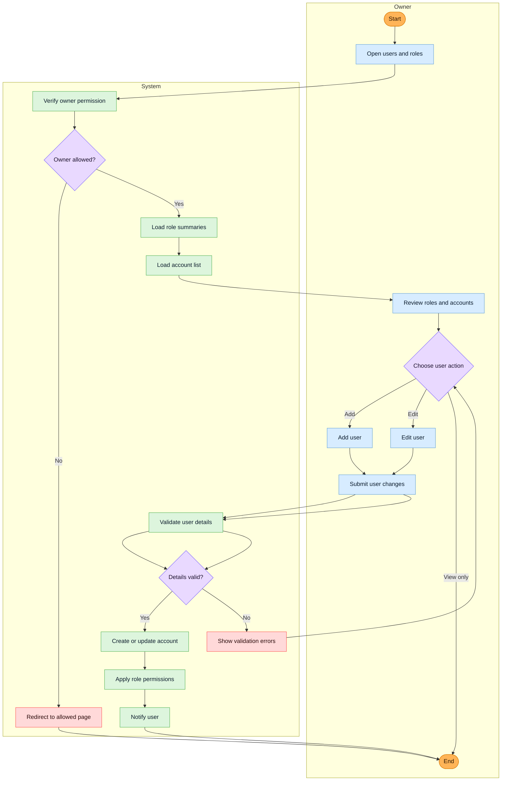
```mermaid
flowchart TD
  subgraph Owner["Owner"]
    direction TB
    A([Start])
    B[Open users and roles]
    C[Review roles and accounts]
    D{Choose user action}
    E[Add user]
    F[Edit user]
    G[Submit user changes]
    Z([End])
  end

  subgraph System["System"]
    direction TB
    H[Verify owner permission]
    I{Owner allowed?}
    J[Load role summaries]
    K[Load account list]
    L[Validate user details]
    M{Details valid?}
    N[Create or update account]
    O[Apply role permissions]
    P[Notify user]
    Q[Redirect to allowed page]
    R[Show validation errors]
  end

  A --> B --> H --> I
  I -- No --> Q --> Z
  I -- Yes --> J --> K --> C --> D
  D -- Add --> E --> G --> L --> M
  D -- Edit --> F --> G --> L --> M
  D -- View only --> Z
  M -- Yes --> N --> O --> P --> Z
  M -- No --> R --> D

  classDef user fill:#D7ECFF,stroke:#5B9BD5,color:#0B1B2B;
  classDef system fill:#DDF5DD,stroke:#4CAF50,color:#0B1B2B;
  classDef decision fill:#E9D9FF,stroke:#7B61FF,color:#1B102B;
  classDef error fill:#FFD9D9,stroke:#FF4D4F,color:#2B0B0B;
  classDef terminal fill:#FFB457,stroke:#D87900,color:#2B1600;
  class A,Z terminal;
  class B,C,E,F,G user;
  class H,J,K,L,N,O,P system;
  class D,I,M decision;
  class Q,R error;
```

## Settings Management

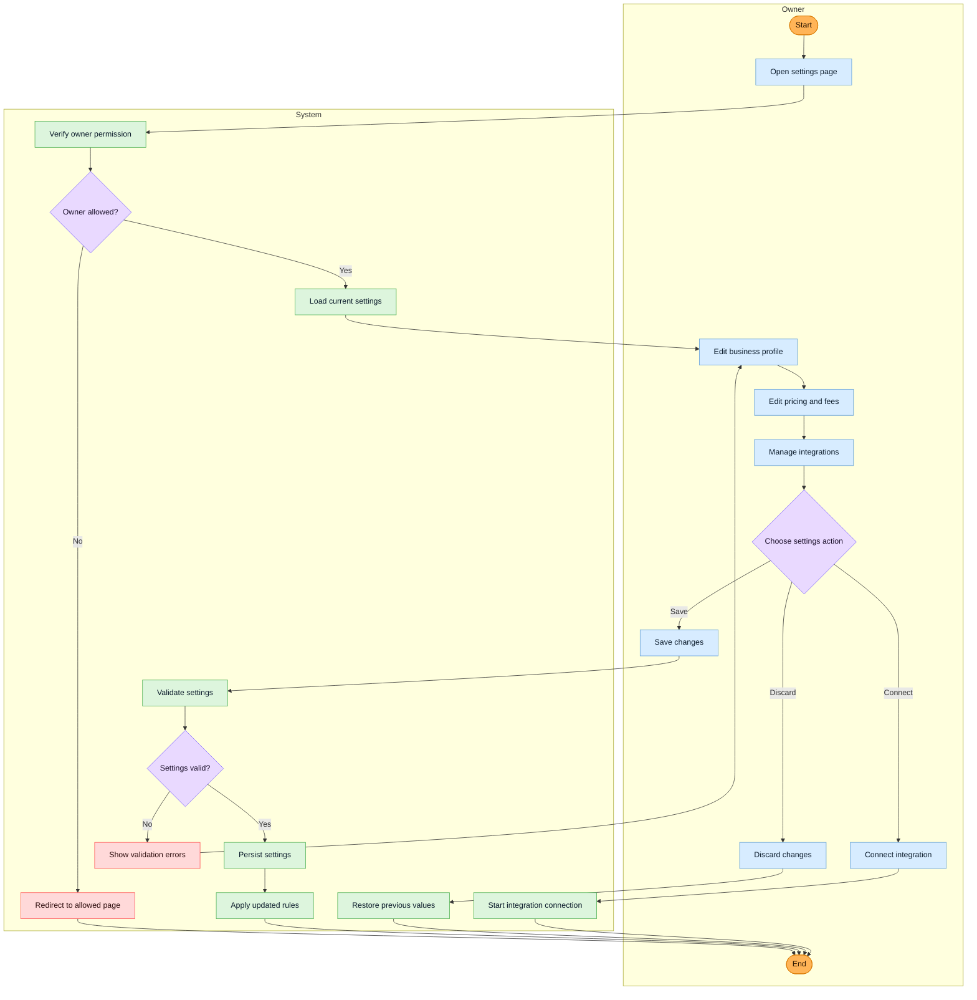
```mermaid
flowchart TD
  subgraph Owner["Owner"]
    direction TB
    A([Start])
    B[Open settings page]
    C[Edit business profile]
    D[Edit pricing and fees]
    E[Manage integrations]
    F{Choose settings action}
    G[Save changes]
    H[Discard changes]
    I[Connect integration]
    Z([End])
  end

  subgraph System["System"]
    direction TB
    J[Verify owner permission]
    K{Owner allowed?}
    L[Load current settings]
    M[Validate settings]
    N{Settings valid?}
    O[Persist settings]
    P[Apply updated rules]
    Q[Restore previous values]
    R[Start integration connection]
    S[Show validation errors]
    T[Redirect to allowed page]
  end

  A --> B --> J --> K
  K -- No --> T --> Z
  K -- Yes --> L --> C --> D --> E --> F
  F -- Save --> G --> M --> N
  N -- Yes --> O --> P --> Z
  N -- No --> S --> C
  F -- Discard --> H --> Q --> Z
  F -- Connect --> I --> R --> Z

  classDef user fill:#D7ECFF,stroke:#5B9BD5,color:#0B1B2B;
  classDef system fill:#DDF5DD,stroke:#4CAF50,color:#0B1B2B;
  classDef decision fill:#E9D9FF,stroke:#7B61FF,color:#1B102B;
  classDef error fill:#FFD9D9,stroke:#FF4D4F,color:#2B0B0B;
  classDef terminal fill:#FFB457,stroke:#D87900,color:#2B1600;
  class A,Z terminal;
  class B,C,D,E,G,H,I user;
  class J,L,M,O,P,Q,R system;
  class F,K,N decision;
  class S,T error;
```

## Staff Sign In and Restricted Access

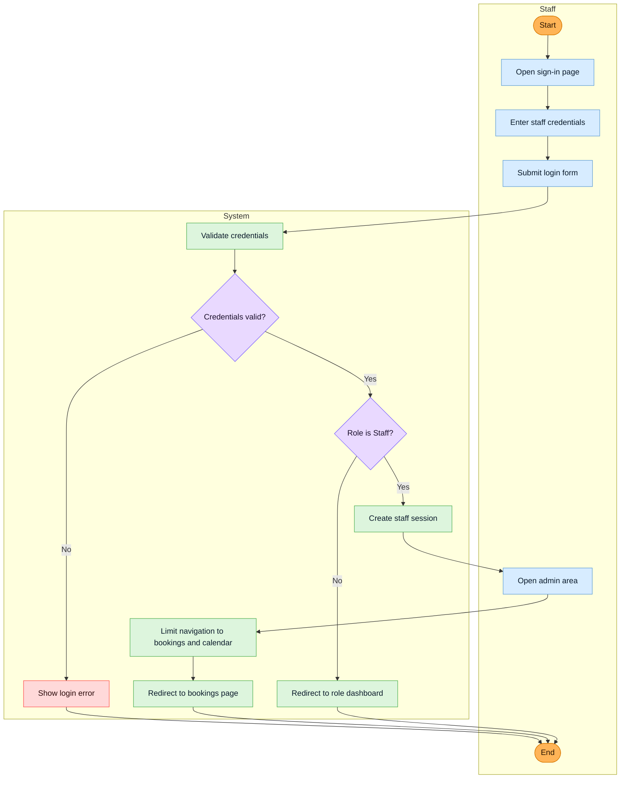
```mermaid
flowchart TD
  subgraph Staff["Staff"]
    direction TB
    A([Start])
    B[Open sign-in page]
    C[Enter staff credentials]
    D[Submit login form]
    E[Open admin area]
    Z([End])
  end

  subgraph System["System"]
    direction TB
    F[Validate credentials]
    G{Credentials valid?}
    H{Role is Staff?}
    I[Create staff session]
    J[Limit navigation to bookings and calendar]
    K[Redirect to bookings page]
    L[Show login error]
    M[Redirect to role dashboard]
  end

  A --> B --> C --> D --> F --> G
  G -- No --> L --> Z
  G -- Yes --> H
  H -- Yes --> I --> E --> J --> K --> Z
  H -- No --> M --> Z

  classDef user fill:#D7ECFF,stroke:#5B9BD5,color:#0B1B2B;
  classDef system fill:#DDF5DD,stroke:#4CAF50,color:#0B1B2B;
  classDef decision fill:#E9D9FF,stroke:#7B61FF,color:#1B102B;
  classDef error fill:#FFD9D9,stroke:#FF4D4F,color:#2B0B0B;
  classDef terminal fill:#FFB457,stroke:#D87900,color:#2B1600;
  class A,Z terminal;
  class B,C,D,E user;
  class F,I,J,K,M system;
  class G,H decision;
  class L error;
```

## Staff Booking Queue Management

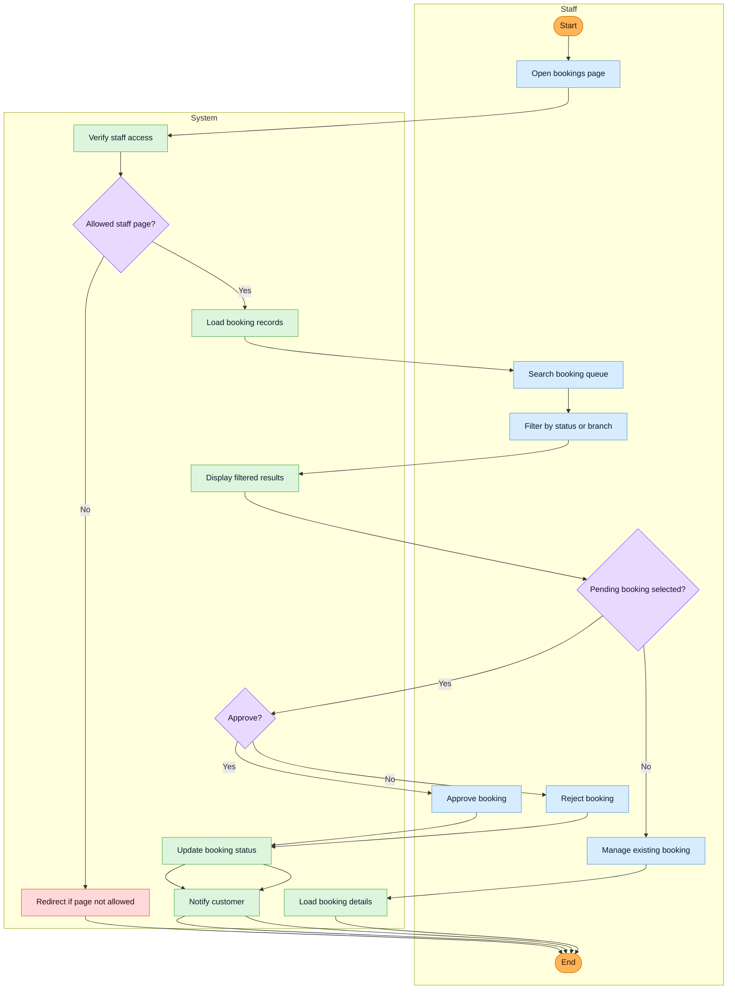
```mermaid
flowchart TD
  subgraph Staff["Staff"]
    direction TB
    A([Start])
    B[Open bookings page]
    C[Search booking queue]
    D[Filter by status or branch]
    E{Pending booking selected?}
    F[Approve booking]
    G[Reject booking]
    H[Manage existing booking]
    Z([End])
  end

  subgraph System["System"]
    direction TB
    I[Verify staff access]
    J[Load booking records]
    K[Display filtered results]
    L[Update booking status]
    M[Notify customer]
    N[Load booking details]
    O[Redirect if page not allowed]
    P{Allowed staff page?}
    Q{Approve?}
  end

  A --> B --> I --> P{Allowed staff page?}
  P -- No --> O --> Z
  P -- Yes --> J --> C --> D --> K --> E
  E -- Yes --> Q{Approve?}
  Q -- Yes --> F --> L --> M --> Z
  Q -- No --> G --> L --> M --> Z
  E -- No --> H --> N --> Z

  classDef user fill:#D7ECFF,stroke:#5B9BD5,color:#0B1B2B;
  classDef system fill:#DDF5DD,stroke:#4CAF50,color:#0B1B2B;
  classDef decision fill:#E9D9FF,stroke:#7B61FF,color:#1B102B;
  classDef error fill:#FFD9D9,stroke:#FF4D4F,color:#2B0B0B;
  classDef terminal fill:#FFB457,stroke:#D87900,color:#2B1600;
  class A,Z terminal;
  class B,C,D,F,G,H user;
  class I,J,K,L,M,N system;
  class E,P,Q decision;
  class O error;
```

## Staff Calendar Review

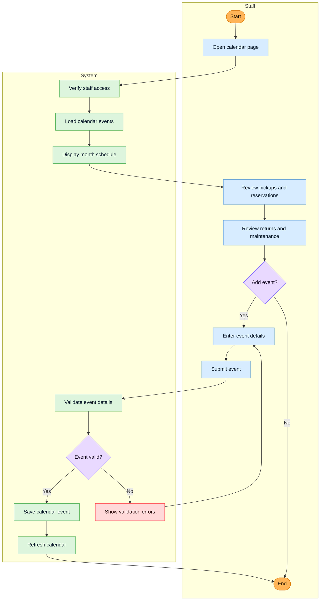
```mermaid
flowchart TD
  subgraph Staff["Staff"]
    direction TB
    A([Start])
    B[Open calendar page]
    C[Review pickups and reservations]
    D[Review returns and maintenance]
    E{Add event?}
    F[Enter event details]
    G[Submit event]
    Z([End])
  end

  subgraph System["System"]
    direction TB
    H[Verify staff access]
    I[Load calendar events]
    J[Display month schedule]
    K[Validate event details]
    L{Event valid?}
    M[Save calendar event]
    N[Refresh calendar]
    O[Show validation errors]
  end

  A --> B --> H --> I --> J --> C --> D --> E
  E -- No --> Z
  E -- Yes --> F --> G --> K --> L
  L -- Yes --> M --> N --> Z
  L -- No --> O --> F

  classDef user fill:#D7ECFF,stroke:#5B9BD5,color:#0B1B2B;
  classDef system fill:#DDF5DD,stroke:#4CAF50,color:#0B1B2B;
  classDef decision fill:#E9D9FF,stroke:#7B61FF,color:#1B102B;
  classDef error fill:#FFD9D9,stroke:#FF4D4F,color:#2B0B0B;
  classDef terminal fill:#FFB457,stroke:#D87900,color:#2B1600;
  class A,Z terminal;
  class B,C,D,F,G user;
  class H,I,J,K,M,N system;
  class E,L decision;
  class O error;
```

## Customer Registration

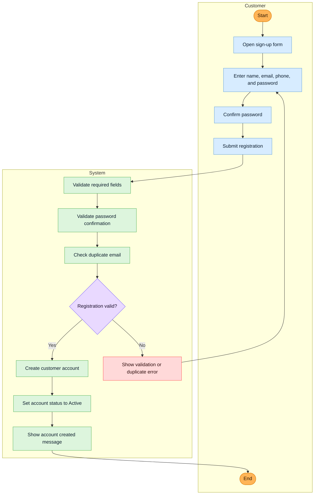
```mermaid
flowchart TD
  subgraph Customer["Customer"]
    direction TB
    A([Start])
    B[Open sign-up form]
    C[Enter name, email, phone, and password]
    D[Confirm password]
    E[Submit registration]
    Z([End])
  end

  subgraph System["System"]
    direction TB
    F[Validate required fields]
    G[Validate password confirmation]
    H[Check duplicate email]
    I{Registration valid?}
    J[Create customer account]
    K[Set account status to Active]
    L[Show account created message]
    M[Show validation or duplicate error]
  end

  A --> B --> C --> D --> E --> F --> G --> H --> I
  I -- Yes --> J --> K --> L --> Z
  I -- No --> M --> C

  classDef user fill:#D7ECFF,stroke:#5B9BD5,color:#0B1B2B;
  classDef system fill:#DDF5DD,stroke:#4CAF50,color:#0B1B2B;
  classDef decision fill:#E9D9FF,stroke:#7B61FF,color:#1B102B;
  classDef error fill:#FFD9D9,stroke:#FF4D4F,color:#2B0B0B;
  classDef terminal fill:#FFB457,stroke:#D87900,color:#2B1600;
  class A,Z terminal;
  class B,C,D,E user;
  class F,G,H,J,K,L system;
  class I decision;
  class M error;
```

## Customer Sign In

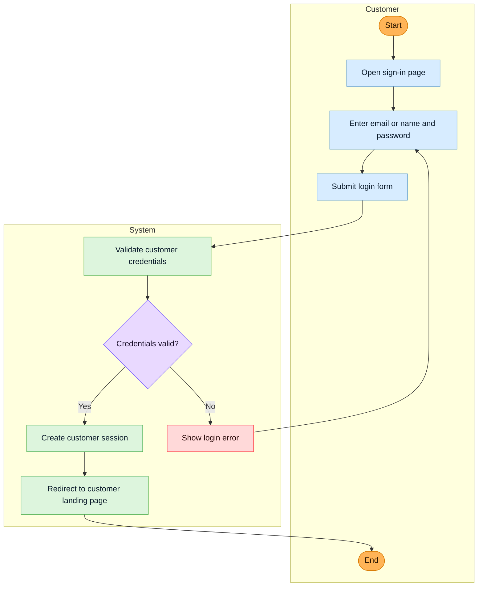
```mermaid
flowchart TD
  subgraph Customer["Customer"]
    direction TB
    A([Start])
    B[Open sign-in page]
    C[Enter email or name and password]
    D[Submit login form]
    Z([End])
  end

  subgraph System["System"]
    direction TB
    E[Validate customer credentials]
    F{Credentials valid?}
    G[Create customer session]
    H[Redirect to customer landing page]
    I[Show login error]
  end

  A --> B --> C --> D --> E --> F
  F -- Yes --> G --> H --> Z
  F -- No --> I --> C

  classDef user fill:#D7ECFF,stroke:#5B9BD5,color:#0B1B2B;
  classDef system fill:#DDF5DD,stroke:#4CAF50,color:#0B1B2B;
  classDef decision fill:#E9D9FF,stroke:#7B61FF,color:#1B102B;
  classDef error fill:#FFD9D9,stroke:#FF4D4F,color:#2B0B0B;
  classDef terminal fill:#FFB457,stroke:#D87900,color:#2B1600;
  class A,Z terminal;
  class B,C,D user;
  class E,G,H system;
  class F decision;
  class I error;
```

## Customer Vehicle Search

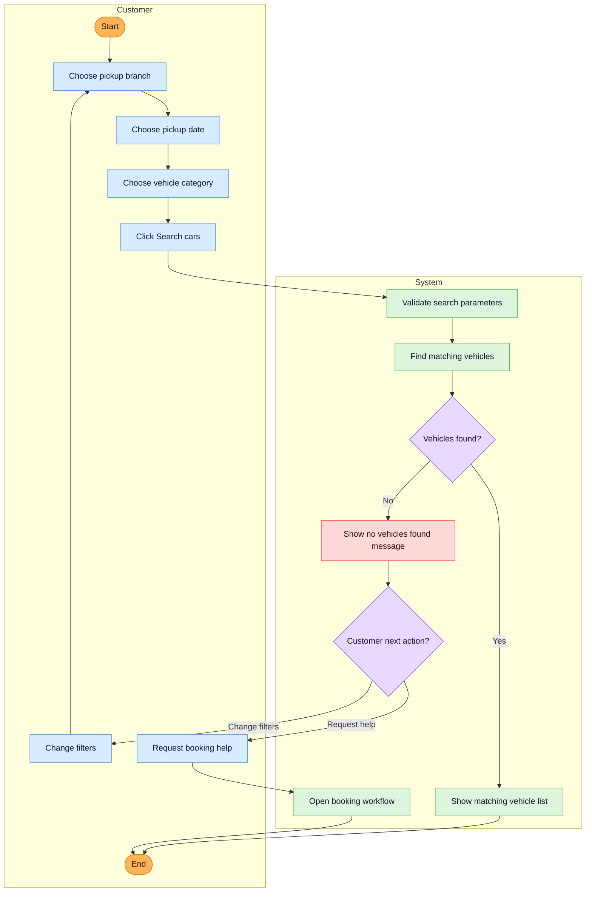
```mermaid
flowchart TD
  subgraph Customer["Customer"]
    direction TB
    A([Start])
    B[Choose pickup branch]
    C[Choose pickup date]
    D[Choose vehicle category]
    E[Click Search cars]
    F[Change filters]
    G[Request booking help]
    Z([End])
  end

  subgraph System["System"]
    direction TB
    H[Validate search parameters]
    I[Find matching vehicles]
    J{Vehicles found?}
    K[Show matching vehicle list]
    L[Show no vehicles found message]
    M[Open booking workflow]
    N{Customer next action?}
  end

  A --> B --> C --> D --> E --> H --> I --> J
  J -- Yes --> K --> Z
  J -- No --> L --> N{Customer next action?}
  N -- Change filters --> F --> B
  N -- Request help --> G --> M --> Z

  classDef user fill:#D7ECFF,stroke:#5B9BD5,color:#0B1B2B;
  classDef system fill:#DDF5DD,stroke:#4CAF50,color:#0B1B2B;
  classDef decision fill:#E9D9FF,stroke:#7B61FF,color:#1B102B;
  classDef error fill:#FFD9D9,stroke:#FF4D4F,color:#2B0B0B;
  classDef terminal fill:#FFB457,stroke:#D87900,color:#2B1600;
  class A,Z terminal;
  class B,C,D,E,F,G user;
  class H,I,K,M system;
  class J,N decision;
  class L error;
```

## Browse Vehicles and Reserve

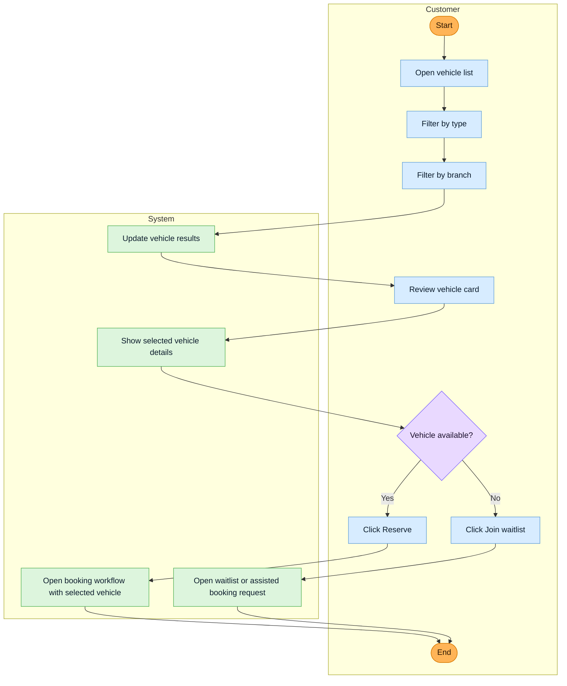
```mermaid
flowchart TD
  subgraph Customer["Customer"]
    direction TB
    A([Start])
    B[Open vehicle list]
    C[Filter by type]
    D[Filter by branch]
    E[Review vehicle card]
    F{Vehicle available?}
    G[Click Reserve]
    H[Click Join waitlist]
    Z([End])
  end

  subgraph System["System"]
    direction TB
    I[Update vehicle results]
    J[Open booking workflow with selected vehicle]
    K[Open waitlist or assisted booking request]
    L[Show selected vehicle details]
  end

  A --> B --> C --> D --> I --> E --> L --> F
  F -- Yes --> G --> J --> Z
  F -- No --> H --> K --> Z

  classDef user fill:#D7ECFF,stroke:#5B9BD5,color:#0B1B2B;
  classDef system fill:#DDF5DD,stroke:#4CAF50,color:#0B1B2B;
  classDef decision fill:#E9D9FF,stroke:#7B61FF,color:#1B102B;
  classDef terminal fill:#FFB457,stroke:#D87900,color:#2B1600;
  class A,Z terminal;
  class B,C,D,E,G,H user;
  class I,J,K,L system;
  class F decision;
```

## Booking Request

```mermaid
flowchart TD
  subgraph Customer["Customer"]
    direction TB
    A([Start])
    B[Open booking page]
    C[Select vehicle]
    D[Select pickup and return branches]
    E[Enter pickup and return date/time]
    F[Enter contact details]
    G[Accept rental policies]
    H[Submit booking request]
    Z([End])
  end

  subgraph System["System"]
    direction TB
    I[Check customer session]
    J{Customer signed in?}
    K[Validate booking details]
    L[Validate return is after pickup]
    M[Calculate estimated total]
    N{Booking valid?}
    O[Create booking request]
    P[Set booking status to Pending]
    Q[Notify operations team]
    R[Show booking confirmation]
    S[Redirect to customer dashboard]
    T[Redirect to sign-in page]
    U[Show field validation errors]
  end

  A --> B --> I --> J
  J -- No --> T --> Z
  J -- Yes --> C --> D --> E --> F --> G --> H --> K --> L --> M --> N
  N -- Yes --> O --> P --> Q --> R --> S --> Z
  N -- No --> U --> C

  classDef user fill:#D7ECFF,stroke:#5B9BD5,color:#0B1B2B;
  classDef system fill:#DDF5DD,stroke:#4CAF50,color:#0B1B2B;
  classDef decision fill:#E9D9FF,stroke:#7B61FF,color:#1B102B;
  classDef error fill:#FFD9D9,stroke:#FF4D4F,color:#2B0B0B;
  classDef terminal fill:#FFB457,stroke:#D87900,color:#2B1600;
  class A,Z terminal;
  class B,C,D,E,F,G,H user;
  class I,K,L,M,O,P,Q,R,S system;
  class J,N decision;
  class T,U error;
```

## Requirement Submission

```mermaid
flowchart TD
  subgraph Customer["Customer"]
    direction TB
    A([Start])
    B[Open customer dashboard]
    C[Upload valid ID]
    D[Upload driver's license]
    E[Submit requirements]
    Z([End])
  end

  subgraph System["System"]
    direction TB
    F[Check customer session]
    G{Customer signed in?}
    H[Validate uploaded files]
    I{Files accepted?}
    J[Save requirement files]
    K[Set verification to Pending Verification]
    L[Notify owner or staff]
    M[Show upload success]
    N[Redirect to sign-in page]
    O[Show upload error]
  end

  A --> B --> F --> G
  G -- No --> N --> Z
  G -- Yes --> C --> D --> E --> H --> I
  I -- Yes --> J --> K --> L --> M --> Z
  I -- No --> O --> C

  classDef user fill:#D7ECFF,stroke:#5B9BD5,color:#0B1B2B;
  classDef system fill:#DDF5DD,stroke:#4CAF50,color:#0B1B2B;
  classDef decision fill:#E9D9FF,stroke:#7B61FF,color:#1B102B;
  classDef error fill:#FFD9D9,stroke:#FF4D4F,color:#2B0B0B;
  classDef terminal fill:#FFB457,stroke:#D87900,color:#2B1600;
  class A,Z terminal;
  class B,C,D,E user;
  class F,H,J,K,L,M system;
  class G,I decision;
  class N,O error;
```

## Payment Proof Submission

```mermaid
flowchart TD
  subgraph Customer["Customer"]
    direction TB
    A([Start])
    B[Open customer dashboard]
    C[Enter payment reference number]
    D[Upload proof of payment]
    E[Submit payment proof]
    Z([End])
  end

  subgraph System["System"]
    direction TB
    F[Check customer session]
    G{Customer signed in?}
    H[Validate reference and proof]
    I{Payment proof accepted?}
    J[Save payment proof]
    K[Set payment status to Pending verification]
    L[Notify owner for review]
    M[Show upload success]
    N[Redirect to sign-in page]
    O[Show payment proof error]
  end

  A --> B --> F --> G
  G -- No --> N --> Z
  G -- Yes --> C --> D --> E --> H --> I
  I -- Yes --> J --> K --> L --> M --> Z
  I -- No --> O --> C

  classDef user fill:#D7ECFF,stroke:#5B9BD5,color:#0B1B2B;
  classDef system fill:#DDF5DD,stroke:#4CAF50,color:#0B1B2B;
  classDef decision fill:#E9D9FF,stroke:#7B61FF,color:#1B102B;
  classDef error fill:#FFD9D9,stroke:#FF4D4F,color:#2B0B0B;
  classDef terminal fill:#FFB457,stroke:#D87900,color:#2B1600;
  class A,Z terminal;
  class B,C,D,E user;
  class F,H,J,K,L,M system;
  class G,I decision;
  class N,O error;
```

## Customer Dashboard Tracking

```mermaid
flowchart TD
  subgraph Customer["Customer"]
    direction TB
    A([Start])
    B[Open customer dashboard]
    C[Review payment status]
    D[Review notifications]
    E[Review rental policies]
    F{Action needed?}
    G[Upload requirements]
    H[Upload payment proof]
    Z([End])
  end

  subgraph System["System"]
    direction TB
    I[Check customer session]
    J{Customer signed in?}
    K[Load customer bookings]
    L[Load payment statuses]
    M[Load notifications and updates]
    N[Load rental policies]
    O[Redirect to sign-in page]
  end

  A --> B --> I --> J
  J -- No --> O --> Z
  J -- Yes --> K --> L --> M --> N --> C --> D --> E --> F
  F -- Requirements needed --> G --> Z
  F -- Payment needed --> H --> Z
  F -- No --> Z

  classDef user fill:#D7ECFF,stroke:#5B9BD5,color:#0B1B2B;
  classDef system fill:#DDF5DD,stroke:#4CAF50,color:#0B1B2B;
  classDef decision fill:#E9D9FF,stroke:#7B61FF,color:#1B102B;
  classDef error fill:#FFD9D9,stroke:#FF4D4F,color:#2B0B0B;
  classDef terminal fill:#FFB457,stroke:#D87900,color:#2B1600;
  class A,Z terminal;
  class B,C,D,E,G,H user;
  class I,K,L,M,N system;
  class F,J decision;
  class O error;
```

## Contact Inquiry

```mermaid
flowchart TD
  subgraph VisitorOrCustomer["Visitor or Customer"]
    direction TB
    A([Start])
    B[Open contact page]
    C[Enter name, email, subject, and message]
    D[Submit message]
    E[Use phone or email contact link]
    Z([End])
  end

  subgraph System["System"]
    direction TB
    F[Validate contact form]
    G{Message valid?}
    H[Save inquiry]
    I[Notify support team]
    J[Show message sent confirmation]
    K[Show validation errors]
    L[Open phone or email app]
    M{Choose contact method?}
  end

  A --> B --> M{Choose contact method?}
  M -- Form --> C --> D --> F --> G
  G -- Yes --> H --> I --> J --> Z
  G -- No --> K --> C
  M -- Direct link --> E --> L --> Z

  classDef user fill:#D7ECFF,stroke:#5B9BD5,color:#0B1B2B;
  classDef system fill:#DDF5DD,stroke:#4CAF50,color:#0B1B2B;
  classDef decision fill:#E9D9FF,stroke:#7B61FF,color:#1B102B;
  classDef error fill:#FFD9D9,stroke:#FF4D4F,color:#2B0B0B;
  classDef terminal fill:#FFB457,stroke:#D87900,color:#2B1600;
  class A,Z terminal;
  class B,C,D,E user;
  class F,H,I,J,L system;
  class G,M decision;
  class K error;
```

## Session and Role Authorization

```mermaid
flowchart TD
  subgraph User["Owner, Staff, or Customer"]
    direction TB
    A([Start])
    B[Request protected page]
    Z([End])
  end

  subgraph System["System"]
    direction TB
    C[Check active session]
    D{Session exists?}
    E[Read account role]
    F{Role can access page?}
    G[Load requested page]
    H[Redirect to allowed dashboard]
    I[Redirect to sign-in page]
  end

  A --> B --> C --> D
  D -- No --> I --> Z
  D -- Yes --> E --> F
  F -- Yes --> G --> Z
  F -- No --> H --> Z

  classDef user fill:#D7ECFF,stroke:#5B9BD5,color:#0B1B2B;
  classDef system fill:#DDF5DD,stroke:#4CAF50,color:#0B1B2B;
  classDef decision fill:#E9D9FF,stroke:#7B61FF,color:#1B102B;
  classDef error fill:#FFD9D9,stroke:#FF4D4F,color:#2B0B0B;
  classDef terminal fill:#FFB457,stroke:#D87900,color:#2B1600;
  class A,Z terminal;
  class B user;
  class C,E,G,H system;
  class D,F decision;
  class I error;
```

## OAuth Sign In or Sign Up

```mermaid
flowchart TD
  subgraph Customer["Customer"]
    direction TB
    A([Start])
    B[Choose Google, Facebook, or Apple]
    Z([End])
  end

  subgraph System["System"]
    direction TB
    C[Start OAuth provider flow]
    D[Validate provider response]
    E{OAuth successful?}
    F[Create or retrieve customer account]
    G[Create customer session]
    H[Redirect to customer landing page]
    I[Show OAuth error]
  end

  subgraph OAuthProvider["OAuth Provider"]
    direction TB
    J[Authenticate customer]
    K[Return authorization result]
  end

  A --> B --> C --> J --> K --> D --> E
  E -- Yes --> F --> G --> H --> Z
  E -- No --> I --> Z

  classDef user fill:#D7ECFF,stroke:#5B9BD5,color:#0B1B2B;
  classDef system fill:#DDF5DD,stroke:#4CAF50,color:#0B1B2B;
  classDef provider fill:#FFF0CC,stroke:#D6A23A,color:#2B1B00;
  classDef decision fill:#E9D9FF,stroke:#7B61FF,color:#1B102B;
  classDef error fill:#FFD9D9,stroke:#FF4D4F,color:#2B0B0B;
  classDef terminal fill:#FFB457,stroke:#D87900,color:#2B1600;
  class A,Z terminal;
  class B user;
  class C,D,F,G,H system;
  class J,K provider;
  class E decision;
  class I error;
```

## Logout

```mermaid
flowchart TD
  subgraph User["Owner, Staff, or Customer"]
    direction TB
    A([Start])
    B[Click Sign out]
    Z([End])
  end

  subgraph System["System"]
    direction TB
    C[Identify active session type]
    D{Session type?}
    E[End customer session]
    F[Redirect to public home page]
    G[End admin session]
    H[Redirect to sign-in page]
    I[Show already signed out state]
  end

  A --> B --> C --> D
  D -- Customer --> E --> F --> Z
  D -- Owner or Staff --> G --> H --> Z
  D -- None --> I --> Z

  classDef user fill:#D7ECFF,stroke:#5B9BD5,color:#0B1B2B;
  classDef system fill:#DDF5DD,stroke:#4CAF50,color:#0B1B2B;
  classDef decision fill:#E9D9FF,stroke:#7B61FF,color:#1B102B;
  classDef error fill:#FFD9D9,stroke:#FF4D4F,color:#2B0B0B;
  classDef terminal fill:#FFB457,stroke:#D87900,color:#2B1600;
  class A,Z terminal;
  class B user;
  class C,E,F,G,H system;
  class D decision;
  class I error;
```

## Error and Not Found Recovery

```mermaid
flowchart TD
  subgraph User["User"]
    direction TB
    A([Start])
    B[Open invalid page or encounter page error]
    C[Click Go home]
    D[Click Try again]
    Z([End])
  end

  subgraph System["System"]
    direction TB
    E{Problem type?}
    F[Show not found message]
    G[Show page load error]
    H[Redirect to home page]
    I[Retry page load]
    J{Retry successful?}
    K[Load page]
    L[Show error again]
    M{User action?}
  end

  A --> B --> E
  E -- Page not found --> F --> C --> H --> Z
  E -- System error --> G --> M{User action?}
  M -- Go home --> C --> H --> Z
  M -- Try again --> D --> I --> J
  J -- Yes --> K --> Z
  J -- No --> L --> M

  classDef user fill:#D7ECFF,stroke:#5B9BD5,color:#0B1B2B;
  classDef system fill:#DDF5DD,stroke:#4CAF50,color:#0B1B2B;
  classDef decision fill:#E9D9FF,stroke:#7B61FF,color:#1B102B;
  classDef error fill:#FFD9D9,stroke:#FF4D4F,color:#2B0B0B;
  classDef terminal fill:#FFB457,stroke:#D87900,color:#2B1600;
  class A,Z terminal;
  class B,C,D user;
  class H,I,K system;
  class E,J,M decision;
  class F,G,L error;
```
