# Activity Diagram Coverage

## Owner
- Owner sign-in, dashboard routing, and admin sidebar access
- Owner dashboard monitoring and report export
- Reports and analytics review
- Decision support forecasting, vehicle recommendation, and branch allocation approval
- Booking management, filtering, status editing, and report export
- Customer record review and requirement verification
- Payment proof review and verification
- Fleet management, vehicle creation, vehicle status control, and service handoff
- Maintenance scheduling and service status tracking
- Operational notification triage
- Users and roles management
- Branch monitoring and branch creation

## Staff
- Staff sign-in and role-based module access
- Booking queue filtering and status management
- Reservation calendar and dispatch review

## Customer
- Visitor browsing, vehicle selection, and booking entry
- Account sign-in and customer registration
- Booking request submission with rental policy agreement
- Requirement submission after booking
- Payment method review and proof-of-payment submission
- Customer dashboard QR and payment status tracking
- Invalid payment resubmission

## Shared/System
- Role-based route protection and sidebar navigation
- Sign-out flow for customer, staff, and owner sessions
- Form validation, success notifications, and alternate/error states

# PlantUML Activity Diagrams

## Shared/System: Role-Based Entry and Route Protection

Based on frontend files/screens:
- `src/components/site/Header.tsx`
- `src/components/admin/AdminShell.tsx`
- Navigation links, customer dashboard link, admin sidebar groups

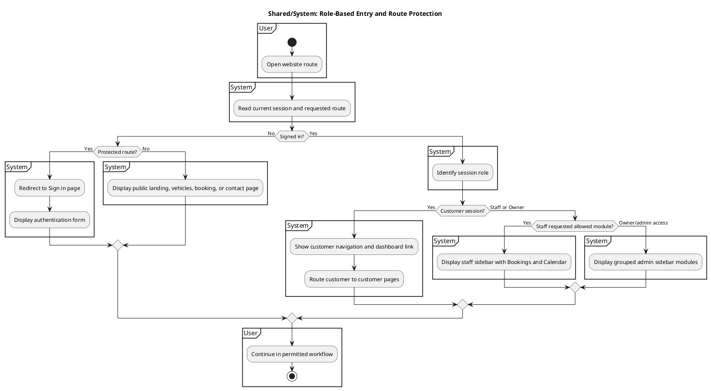
```plantuml
@startuml
title Shared/System: Role-Based Entry and Route Protection

partition "User" {
  start
  :Open website route;
}

partition "System" {
  :Read current session and requested route;
}

if (Signed in?) then (No)
  if (Protected route?) then (Yes)
    partition "System" {
      :Redirect to Sign in page;
      :Display authentication form;
    }
  else (No)
    partition "System" {
      :Display public landing, vehicles, booking, or contact page;
    }
  endif
else (Yes)
  partition "System" {
    :Identify session role;
  }
  if (Customer session?) then (Yes)
    partition "System" {
      :Show customer navigation and dashboard link;
      :Route customer to customer pages;
    }
  else (Staff or Owner)
    if (Staff requested allowed module?) then (Yes)
      partition "System" {
        :Display staff sidebar with Bookings and Calendar;
      }
    else (Owner/admin access)
      partition "System" {
        :Display grouped admin sidebar modules;
      }
    endif
  endif
endif

partition "User" {
  :Continue in permitted workflow;
  stop
}
@enduml
```

## Shared/System: Sign In and Customer Registration

Based on frontend files/screens:
- `src/components/site/SignInDialog.tsx`
- `src/routes/sign-in.tsx`
- Sign in tab, create account tab, provider buttons, customer registration fields

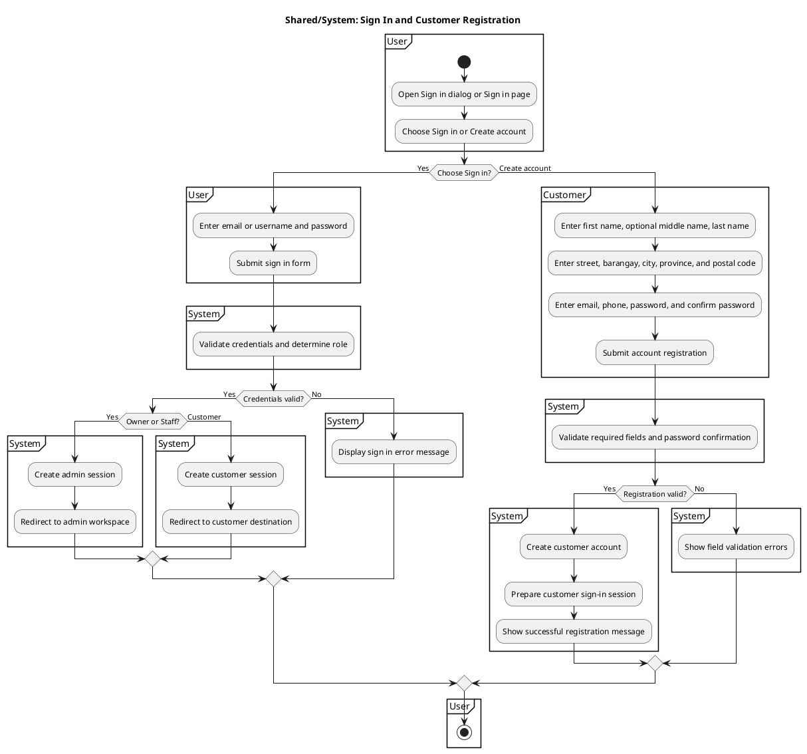
```plantuml
@startuml
title Shared/System: Sign In and Customer Registration

partition "User" {
  start
  :Open Sign in dialog or Sign in page;
  :Choose Sign in or Create account;
}

if (Choose Sign in?) then (Yes)
  partition "User" {
    :Enter email or username and password;
    :Submit sign in form;
  }
  partition "System" {
    :Validate credentials and determine role;
  }
  if (Credentials valid?) then (Yes)
    if (Owner or Staff?) then (Yes)
      partition "System" {
        :Create admin session;
        :Redirect to admin workspace;
      }
    else (Customer)
      partition "System" {
        :Create customer session;
        :Redirect to customer destination;
      }
    endif
  else (No)
    partition "System" {
      :Display sign in error message;
    }
  endif
else (Create account)
  partition "Customer" {
    :Enter first name, optional middle name, last name;
    :Enter street, barangay, city, province, and postal code;
    :Enter email, phone, password, and confirm password;
    :Submit account registration;
  }
  partition "System" {
    :Validate required fields and password confirmation;
  }
  if (Registration valid?) then (Yes)
    partition "System" {
      :Create customer account;
      :Prepare customer sign-in session;
      :Show successful registration message;
    }
  else (No)
    partition "System" {
      :Show field validation errors;
    }
  endif
endif

partition "User" {
  stop
}
@enduml
```

## Shared/System: Sign Out

Based on frontend files/screens:
- `src/components/admin/AdminShell.tsx`
- Header profile menu, Sign out action

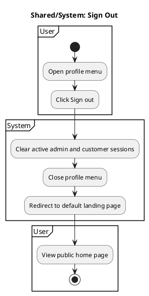
```plantuml
@startuml
title Shared/System: Sign Out

partition "User" {
  start
  :Open profile menu;
  :Click Sign out;
}

partition "System" {
  :Clear active admin and customer sessions;
  :Close profile menu;
  :Redirect to default landing page;
}

partition "User" {
  :View public home page;
  stop
}
@enduml
```

## Customer: Browse Fleet and Start Booking

Based on frontend files/screens:
- `src/routes/index.tsx`
- `src/routes/vehicles.tsx`
- `src/components/site/VehicleCard.tsx`
- Reserve button, fleet cards, filters, booking navigation

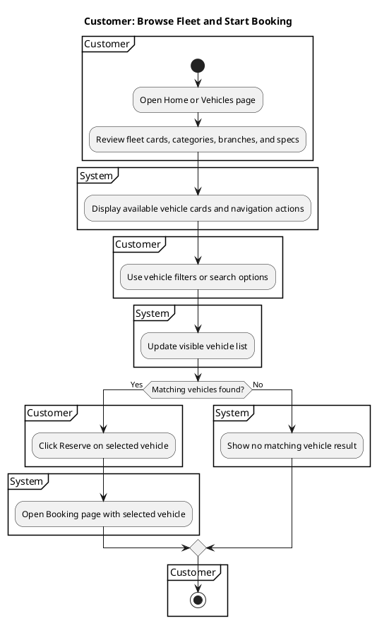
```plantuml
@startuml
title Customer: Browse Fleet and Start Booking

partition "Customer" {
  start
  :Open Home or Vehicles page;
  :Review fleet cards, categories, branches, and specs;
}

partition "System" {
  :Display available vehicle cards and navigation actions;
}

partition "Customer" {
  :Use vehicle filters or search options;
}

partition "System" {
  :Update visible vehicle list;
}

if (Matching vehicles found?) then (Yes)
  partition "Customer" {
    :Click Reserve on selected vehicle;
  }
  partition "System" {
    :Open Booking page with selected vehicle;
  }
else (No)
  partition "System" {
    :Show no matching vehicle result;
  }
endif

partition "Customer" {
  stop
}
@enduml
```

## Customer: Booking Request and Rental Policy Agreement

Based on frontend files/screens:
- `src/routes/booking.tsx`
- Trip details card, customer details fields, vehicle summary card
- Request booking button, I agree checkbox, rental do's and don'ts modal

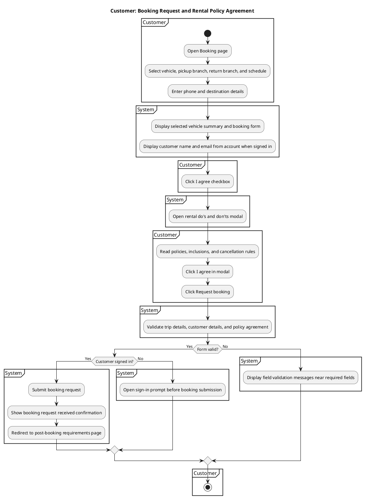
```plantuml
@startuml
title Customer: Booking Request and Rental Policy Agreement

partition "Customer" {
  start
  :Open Booking page;
  :Select vehicle, pickup branch, return branch, and schedule;
  :Enter phone and destination details;
}

partition "System" {
  :Display selected vehicle summary and booking form;
  :Display customer name and email from account when signed in;
}

partition "Customer" {
  :Click I agree checkbox;
}

partition "System" {
  :Open rental do's and don'ts modal;
}

partition "Customer" {
  :Read policies, inclusions, and cancellation rules;
  :Click I agree in modal;
  :Click Request booking;
}

partition "System" {
  :Validate trip details, customer details, and policy agreement;
}

if (Form valid?) then (Yes)
  if (Customer signed in?) then (Yes)
    partition "System" {
      :Submit booking request;
      :Show booking request received confirmation;
      :Redirect to post-booking requirements page;
    }
  else (No)
    partition "System" {
      :Open sign-in prompt before booking submission;
    }
  endif
else (No)
  partition "System" {
    :Display field validation messages near required fields;
  }
endif

partition "Customer" {
  stop
}
@enduml
```

## Customer: Post-Booking Requirement Submission

Based on frontend files/screens:
- `src/routes/customer.tsx`
- `/customer#post-booking`
- Requirement Submission page, Valid ID upload, Driver's License upload, Submit Requirements button

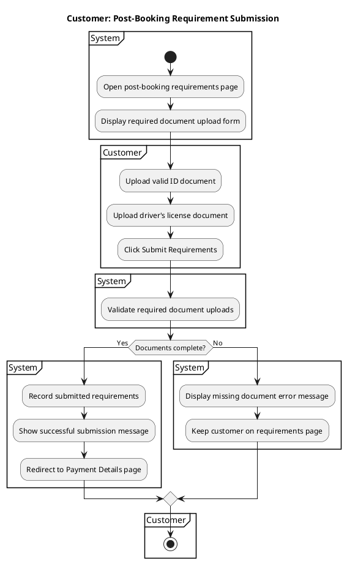
```plantuml
@startuml
title Customer: Post-Booking Requirement Submission

partition "System" {
  start
  :Open post-booking requirements page;
  :Display required document upload form;
}

partition "Customer" {
  :Upload valid ID document;
  :Upload driver's license document;
  :Click Submit Requirements;
}

partition "System" {
  :Validate required document uploads;
}

if (Documents complete?) then (Yes)
  partition "System" {
    :Record submitted requirements;
    :Show successful submission message;
    :Redirect to Payment Details page;
  }
else (No)
  partition "System" {
    :Display missing document error message;
    :Keep customer on requirements page;
  }
endif

partition "Customer" {
  stop
}
@enduml
```

## Customer: Payment Details and Proof Submission

Based on frontend files/screens:
- `src/routes/payment-details.tsx`
- GCash, BPI, BDO payment cards
- Reference number field, proof-of-payment upload, Submit Proof button

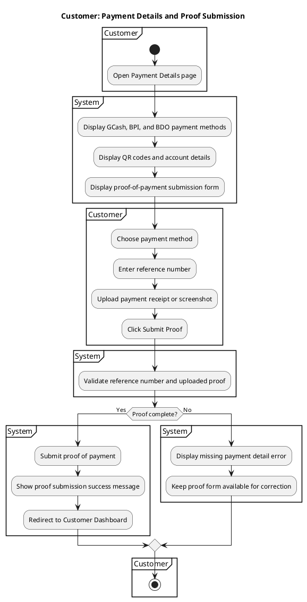
```plantuml
@startuml
title Customer: Payment Details and Proof Submission

partition "Customer" {
  start
  :Open Payment Details page;
}

partition "System" {
  :Display GCash, BPI, and BDO payment methods;
  :Display QR codes and account details;
  :Display proof-of-payment submission form;
}

partition "Customer" {
  :Choose payment method;
  :Enter reference number;
  :Upload payment receipt or screenshot;
  :Click Submit Proof;
}

partition "System" {
  :Validate reference number and uploaded proof;
}

if (Proof complete?) then (Yes)
  partition "System" {
    :Submit proof of payment;
    :Show proof submission success message;
    :Redirect to Customer Dashboard;
  }
else (No)
  partition "System" {
    :Display missing payment detail error;
    :Keep proof form available for correction;
  }
endif

partition "Customer" {
  stop
}
@enduml
```

## Customer: Dashboard QR and Payment Status Tracking

Based on frontend files/screens:
- `src/routes/customer.tsx`
- Customer Dashboard QR card, highlighted payment summary, payment status list
- Invalid status row and Resubmit button

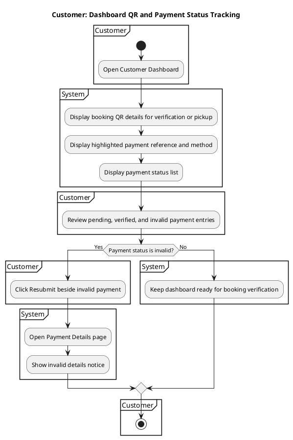
```plantuml
@startuml
title Customer: Dashboard QR and Payment Status Tracking

partition "Customer" {
  start
  :Open Customer Dashboard;
}

partition "System" {
  :Display booking QR details for verification or pickup;
  :Display highlighted payment reference and method;
  :Display payment status list;
}

partition "Customer" {
  :Review pending, verified, and invalid payment entries;
}

if (Payment status is invalid?) then (Yes)
  partition "Customer" {
    :Click Resubmit beside invalid payment;
  }
  partition "System" {
    :Open Payment Details page;
    :Show invalid details notice;
  }
else (No)
  partition "System" {
    :Keep dashboard ready for booking verification;
  }
endif

partition "Customer" {
  stop
}
@enduml
```

## Customer: Invalid Payment Resubmission

Based on frontend files/screens:
- `src/routes/customer.tsx`
- `src/routes/payment-details.tsx`
- Resubmit button, invalid details modal, proof-of-payment form

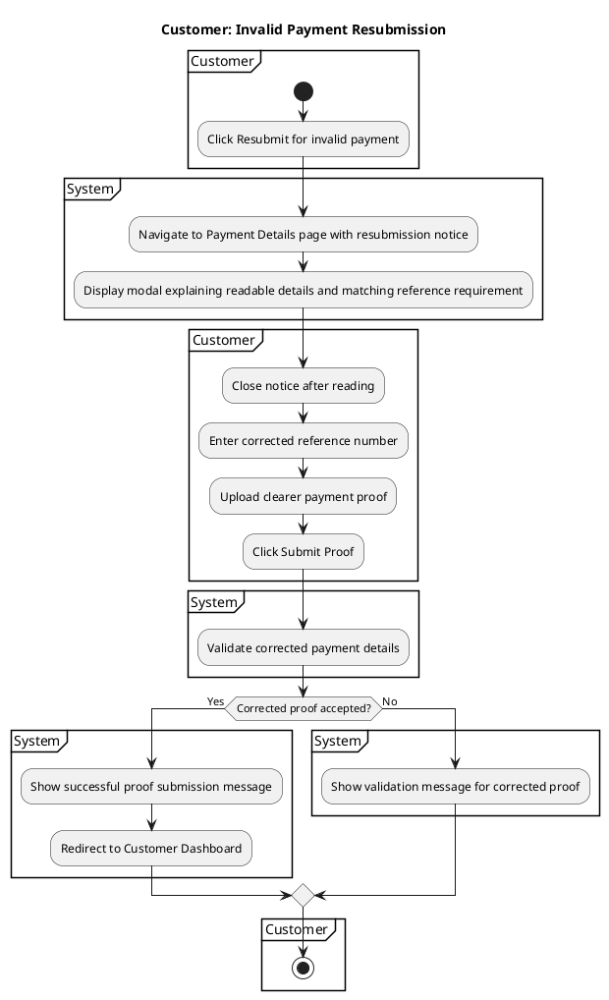
```plantuml
@startuml
title Customer: Invalid Payment Resubmission

partition "Customer" {
  start
  :Click Resubmit for invalid payment;
}

partition "System" {
  :Navigate to Payment Details page with resubmission notice;
  :Display modal explaining readable details and matching reference requirement;
}

partition "Customer" {
  :Close notice after reading;
  :Enter corrected reference number;
  :Upload clearer payment proof;
  :Click Submit Proof;
}

partition "System" {
  :Validate corrected payment details;
}

if (Corrected proof accepted?) then (Yes)
  partition "System" {
    :Show successful proof submission message;
    :Redirect to Customer Dashboard;
  }
else (No)
  partition "System" {
    :Show validation message for corrected proof;
  }
endif

partition "Customer" {
  stop
}
@enduml
```

## Staff: Sign In and Allowed Module Access

Based on frontend files/screens:
- `src/components/site/SignInDialog.tsx`
- `src/components/admin/AdminShell.tsx`
- Staff sidebar with Bookings and Calendar modules

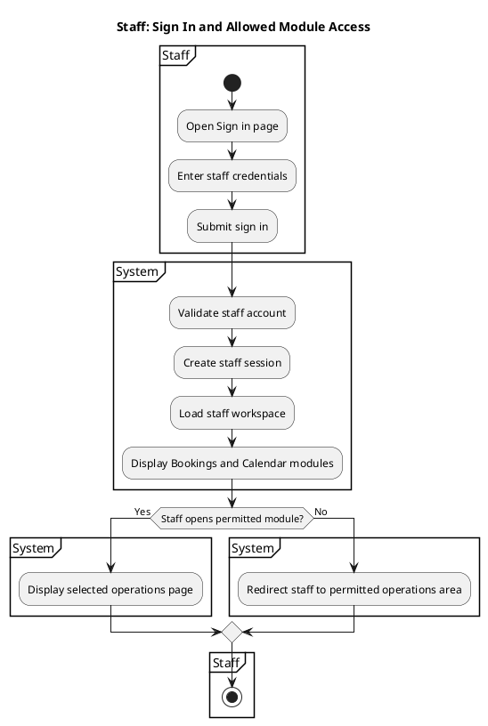
```plantuml
@startuml
title Staff: Sign In and Allowed Module Access

partition "Staff" {
  start
  :Open Sign in page;
  :Enter staff credentials;
  :Submit sign in;
}

partition "System" {
  :Validate staff account;
  :Create staff session;
  :Load staff workspace;
  :Display Bookings and Calendar modules;
}

if (Staff opens permitted module?) then (Yes)
  partition "System" {
    :Display selected operations page;
  }
else (No)
  partition "System" {
    :Redirect staff to permitted operations area;
  }
endif

partition "Staff" {
  stop
}
@enduml
```

## Staff: Booking Queue Status Management

Based on frontend files/screens:
- `src/routes/admin.bookings.tsx`
- Search, status filter, branch filter, Export button
- Manage button, status dropdown, Save and Cancel buttons

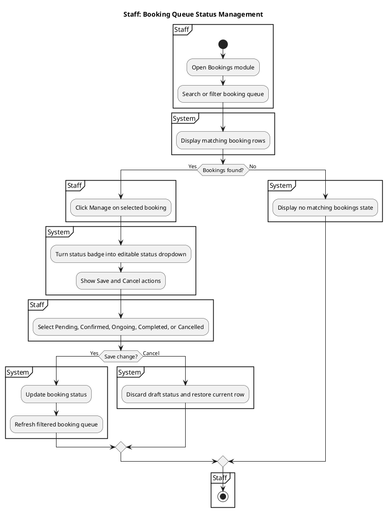
```plantuml
@startuml
title Staff: Booking Queue Status Management

partition "Staff" {
  start
  :Open Bookings module;
  :Search or filter booking queue;
}

partition "System" {
  :Display matching booking rows;
}

if (Bookings found?) then (Yes)
  partition "Staff" {
    :Click Manage on selected booking;
  }
  partition "System" {
    :Turn status badge into editable status dropdown;
    :Show Save and Cancel actions;
  }
  partition "Staff" {
    :Select Pending, Confirmed, Ongoing, Completed, or Cancelled;
  }
  if (Save change?) then (Yes)
    partition "System" {
      :Update booking status;
      :Refresh filtered booking queue;
    }
  else (Cancel)
    partition "System" {
      :Discard draft status and restore current row;
    }
  endif
else (No)
  partition "System" {
    :Display no matching bookings state;
  }
endif

partition "Staff" {
  stop
}
@enduml
```

## Staff: Reservation Calendar and Dispatch Review

Based on frontend files/screens:
- `src/routes/admin.calendar.tsx`
- Day, Week, Month controls, New Event button, calendar grid
- Upcoming pickups, Service and returns lists

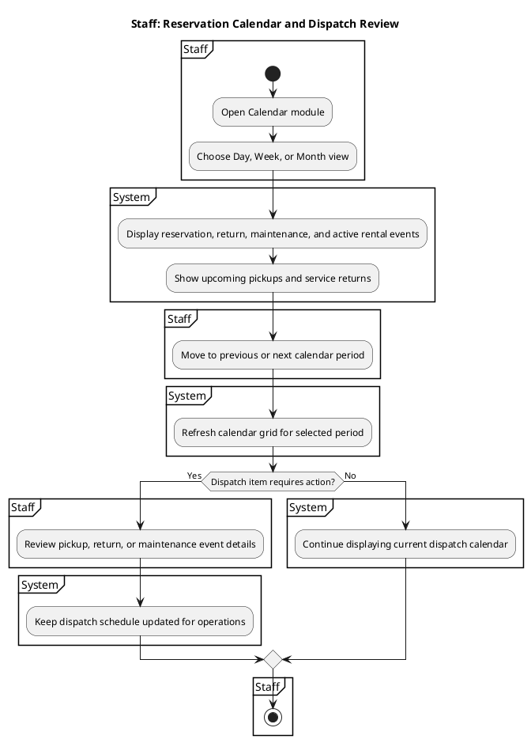
```plantuml
@startuml
title Staff: Reservation Calendar and Dispatch Review

partition "Staff" {
  start
  :Open Calendar module;
  :Choose Day, Week, or Month view;
}

partition "System" {
  :Display reservation, return, maintenance, and active rental events;
  :Show upcoming pickups and service returns;
}

partition "Staff" {
  :Move to previous or next calendar period;
}

partition "System" {
  :Refresh calendar grid for selected period;
}

if (Dispatch item requires action?) then (Yes)
  partition "Staff" {
    :Review pickup, return, or maintenance event details;
  }
  partition "System" {
    :Keep dispatch schedule updated for operations;
  }
else (No)
  partition "System" {
    :Continue displaying current dispatch calendar;
  }
endif

partition "Staff" {
  stop
}
@enduml
```

## Owner: Dashboard Monitoring and Export

Based on frontend files/screens:
- `src/routes/admin.index.tsx`
- Admin Dashboard KPIs, charts, latest bookings, alerts, Export report button

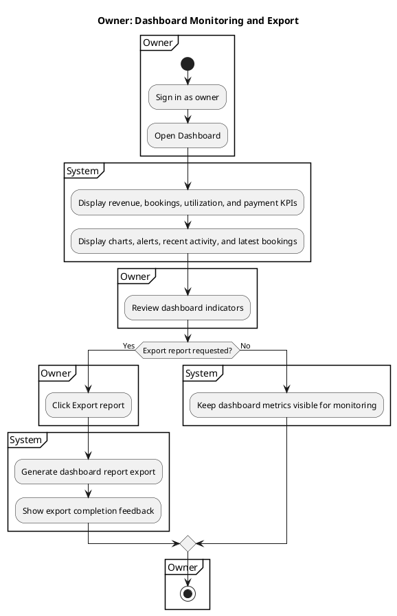
```plantuml
@startuml
title Owner: Dashboard Monitoring and Export

partition "Owner" {
  start
  :Sign in as owner;
  :Open Dashboard;
}

partition "System" {
  :Display revenue, bookings, utilization, and payment KPIs;
  :Display charts, alerts, recent activity, and latest bookings;
}

partition "Owner" {
  :Review dashboard indicators;
}

if (Export report requested?) then (Yes)
  partition "Owner" {
    :Click Export report;
  }
  partition "System" {
    :Generate dashboard report export;
    :Show export completion feedback;
  }
else (No)
  partition "System" {
    :Keep dashboard metrics visible for monitoring;
  }
endif

partition "Owner" {
  stop
}
@enduml
```

## Owner: Reports and Analytics Review

Based on frontend files/screens:
- `src/routes/admin.reports.tsx`
- Reports and Analytics KPIs, monthly revenue, utilization, branch performance, top categories

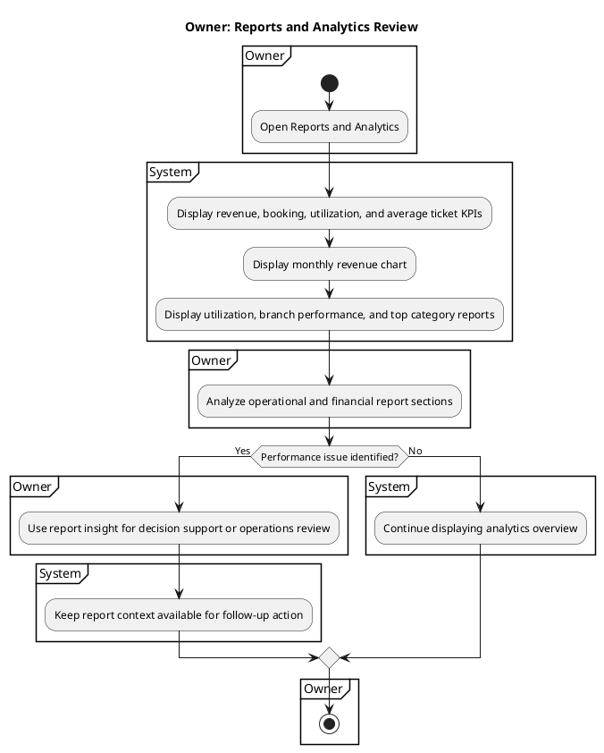
```plantuml
@startuml
title Owner: Reports and Analytics Review

partition "Owner" {
  start
  :Open Reports and Analytics;
}

partition "System" {
  :Display revenue, booking, utilization, and average ticket KPIs;
  :Display monthly revenue chart;
  :Display utilization, branch performance, and top category reports;
}

partition "Owner" {
  :Analyze operational and financial report sections;
}

if (Performance issue identified?) then (Yes)
  partition "Owner" {
    :Use report insight for decision support or operations review;
  }
  partition "System" {
    :Keep report context available for follow-up action;
  }
else (No)
  partition "System" {
    :Continue displaying analytics overview;
  }
endif

partition "Owner" {
  stop
}
@enduml
```

## Owner: Decision Support and Branch Allocation

Based on frontend files/screens:
- `src/routes/admin.decisions.tsx`
- Demand forecasting, vehicle utilization, idle vehicles, branch demand
- Recommend vehicle button, branch allocation recommendation cards, Approve transfer button

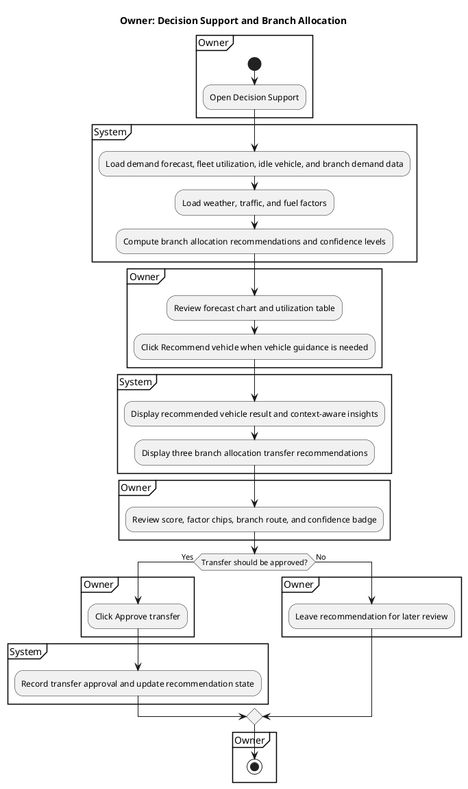
```plantuml
@startuml
title Owner: Decision Support and Branch Allocation

partition "Owner" {
  start
  :Open Decision Support;
}

partition "System" {
  :Load demand forecast, fleet utilization, idle vehicle, and branch demand data;
  :Load weather, traffic, and fuel factors;
  :Compute branch allocation recommendations and confidence levels;
}

partition "Owner" {
  :Review forecast chart and utilization table;
  :Click Recommend vehicle when vehicle guidance is needed;
}

partition "System" {
  :Display recommended vehicle result and context-aware insights;
  :Display three branch allocation transfer recommendations;
}

partition "Owner" {
  :Review score, factor chips, branch route, and confidence badge;
}

if (Transfer should be approved?) then (Yes)
  partition "Owner" {
    :Click Approve transfer;
  }
  partition "System" {
    :Record transfer approval and update recommendation state;
  }
else (No)
  partition "Owner" {
    :Leave recommendation for later review;
  }
endif

partition "Owner" {
  stop
}
@enduml
```

## Owner: Booking Management and Export

Based on frontend files/screens:
- `src/routes/admin.bookings.tsx`
- Search field, status and branch filters, More filters, Export button
- Manage status dropdown, Save and Cancel buttons

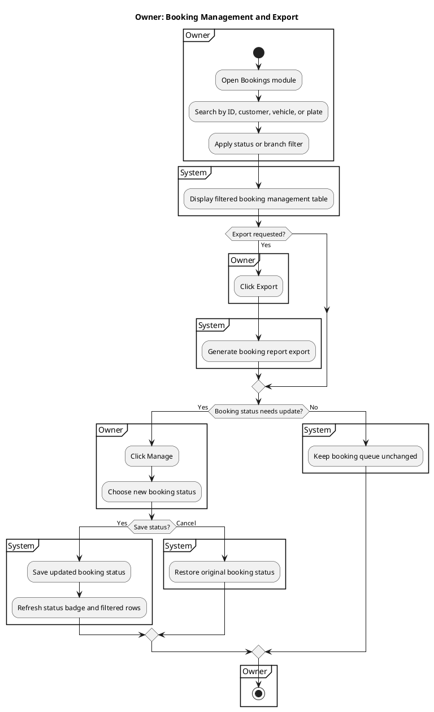
```plantuml
@startuml
title Owner: Booking Management and Export

partition "Owner" {
  start
  :Open Bookings module;
  :Search by ID, customer, vehicle, or plate;
  :Apply status or branch filter;
}

partition "System" {
  :Display filtered booking management table;
}

if (Export requested?) then (Yes)
  partition "Owner" {
    :Click Export;
  }
  partition "System" {
    :Generate booking report export;
  }
endif

if (Booking status needs update?) then (Yes)
  partition "Owner" {
    :Click Manage;
    :Choose new booking status;
  }
  if (Save status?) then (Yes)
    partition "System" {
      :Save updated booking status;
      :Refresh status badge and filtered rows;
    }
  else (Cancel)
    partition "System" {
      :Restore original booking status;
    }
  endif
else (No)
  partition "System" {
    :Keep booking queue unchanged;
  }
endif

partition "Owner" {
  stop
}
@enduml
```

## Owner: Customer Records and Requirement Verification

Based on frontend files/screens:
- `src/routes/admin.customers.tsx`
- Customer search, customer table, customer detail panel
- Uploaded requirements list, Approve and Reject buttons

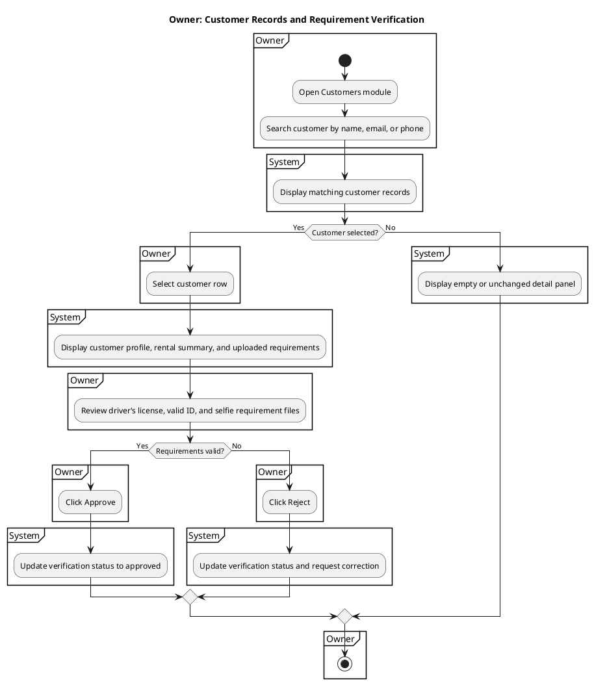
```plantuml
@startuml
title Owner: Customer Records and Requirement Verification

partition "Owner" {
  start
  :Open Customers module;
  :Search customer by name, email, or phone;
}

partition "System" {
  :Display matching customer records;
}

if (Customer selected?) then (Yes)
  partition "Owner" {
    :Select customer row;
  }
  partition "System" {
    :Display customer profile, rental summary, and uploaded requirements;
  }
  partition "Owner" {
    :Review driver's license, valid ID, and selfie requirement files;
  }
  if (Requirements valid?) then (Yes)
    partition "Owner" {
      :Click Approve;
    }
    partition "System" {
      :Update verification status to approved;
    }
  else (No)
    partition "Owner" {
      :Click Reject;
    }
    partition "System" {
      :Update verification status and request correction;
    }
  endif
else (No)
  partition "System" {
    :Display empty or unchanged detail panel;
  }
endif

partition "Owner" {
  stop
}
@enduml
```

## Owner: Payment Proof Verification

Based on frontend files/screens:
- `src/routes/admin.payments.tsx`
- Payment queue, status KPIs, proof preview panel
- Verify payment button, reject action button

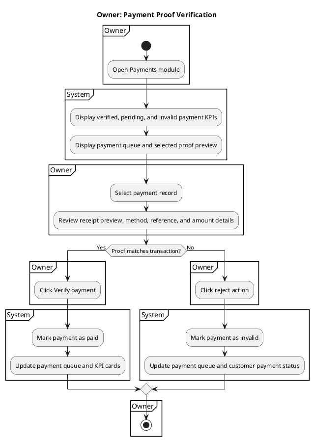
```plantuml
@startuml
title Owner: Payment Proof Verification

partition "Owner" {
  start
  :Open Payments module;
}

partition "System" {
  :Display verified, pending, and invalid payment KPIs;
  :Display payment queue and selected proof preview;
}

partition "Owner" {
  :Select payment record;
  :Review receipt preview, method, reference, and amount details;
}

if (Proof matches transaction?) then (Yes)
  partition "Owner" {
    :Click Verify payment;
  }
  partition "System" {
    :Mark payment as paid;
    :Update payment queue and KPI cards;
  }
else (No)
  partition "Owner" {
    :Click reject action;
  }
  partition "System" {
    :Mark payment as invalid;
    :Update payment queue and customer payment status;
  }
endif

partition "Owner" {
  stop
}
@enduml
```

## Owner: Fleet Management, Add Vehicle, and Status Control

Based on frontend files/screens:
- `src/routes/admin.fleet.tsx`
- Fleet KPI cards, Add vehicle button, grid/table toggle, vehicle cards/table rows
- Add Vehicle modal, status dropdowns, Service now button

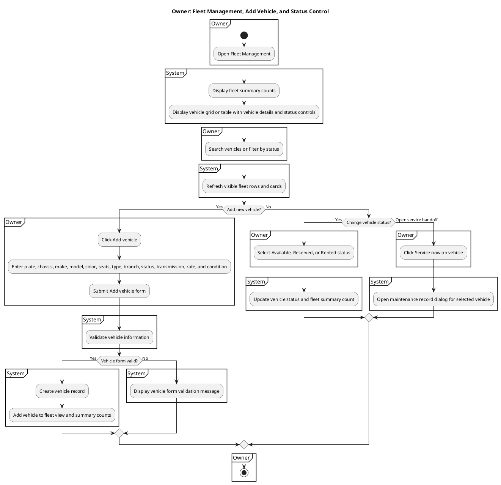
```plantuml
@startuml
title Owner: Fleet Management, Add Vehicle, and Status Control

partition "Owner" {
  start
  :Open Fleet Management;
}

partition "System" {
  :Display fleet summary counts;
  :Display vehicle grid or table with vehicle details and status controls;
}

partition "Owner" {
  :Search vehicles or filter by status;
}

partition "System" {
  :Refresh visible fleet rows and cards;
}

if (Add new vehicle?) then (Yes)
  partition "Owner" {
    :Click Add vehicle;
    :Enter plate, chassis, make, model, color, seats, type, branch, status, transmission, rate, and condition;
    :Submit Add vehicle form;
  }
  partition "System" {
    :Validate vehicle information;
  }
  if (Vehicle form valid?) then (Yes)
    partition "System" {
      :Create vehicle record;
      :Add vehicle to fleet view and summary counts;
    }
  else (No)
    partition "System" {
      :Display vehicle form validation message;
    }
  endif
else (No)
  if (Change vehicle status?) then (Yes)
    partition "Owner" {
      :Select Available, Reserved, or Rented status;
    }
    partition "System" {
      :Update vehicle status and fleet summary count;
    }
  else (Open service handoff)
    partition "Owner" {
      :Click Service now on vehicle;
    }
    partition "System" {
      :Open maintenance record dialog for selected vehicle;
    }
  endif
endif

partition "Owner" {
  stop
}
@enduml
```

## Owner: Maintenance Scheduling and Service Status Tracking

Based on frontend files/screens:
- `src/routes/admin.maintenance.tsx`
- `src/components/admin/MaintenanceRecordDialog.tsx`
- Schedule service button, maintenance dialog, service schedule table, action status dropdown

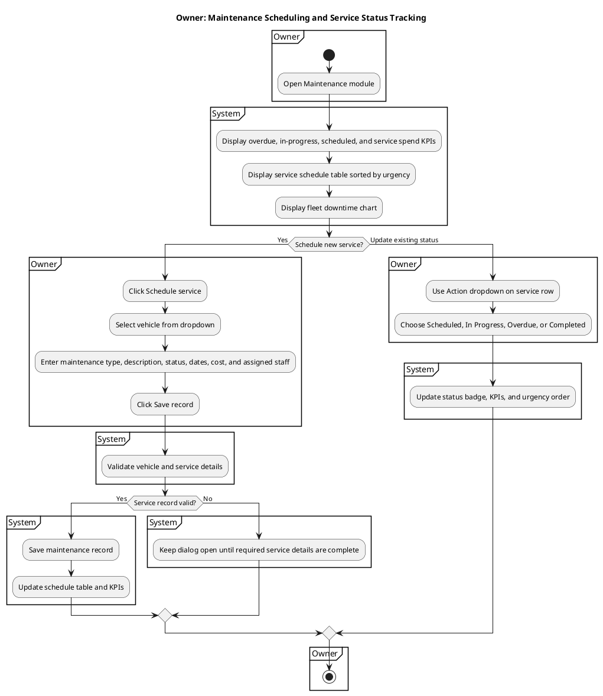
```plantuml
@startuml
title Owner: Maintenance Scheduling and Service Status Tracking

partition "Owner" {
  start
  :Open Maintenance module;
}

partition "System" {
  :Display overdue, in-progress, scheduled, and service spend KPIs;
  :Display service schedule table sorted by urgency;
  :Display fleet downtime chart;
}

if (Schedule new service?) then (Yes)
  partition "Owner" {
    :Click Schedule service;
    :Select vehicle from dropdown;
    :Enter maintenance type, description, status, dates, cost, and assigned staff;
    :Click Save record;
  }
  partition "System" {
    :Validate vehicle and service details;
  }
  if (Service record valid?) then (Yes)
    partition "System" {
      :Save maintenance record;
      :Update schedule table and KPIs;
    }
  else (No)
    partition "System" {
      :Keep dialog open until required service details are complete;
    }
  endif
else (Update existing status)
  partition "Owner" {
    :Use Action dropdown on service row;
    :Choose Scheduled, In Progress, Overdue, or Completed;
  }
  partition "System" {
    :Update status badge, KPIs, and urgency order;
  }
endif

partition "Owner" {
  stop
}
@enduml
```

## Owner: Operational Notification Triage

Based on frontend files/screens:
- `src/routes/admin.notifications.tsx`
- Summary cards, filter chips, notification groups
- Mark all read, Clear archive, row actions

```plantuml
@startuml
title Owner: Operational Notification Triage

partition "Owner" {
  start
  :Open Notifications module;
}

partition "System" {
  :Display unread, needs action, operational alert, and update counts;
  :Group notifications by priority and category;
}

partition "Owner" {
  :Select filter chip or review grouped notifications;
}

partition "System" {
  :Filter notifications by selected category;
}

if (Notification action needed?) then (Yes)
  partition "Owner" {
    :Click notification action such as Review booking, View payment, View service, Manage fleet, or Verify ID;
  }
  partition "System" {
    :Open related operations context;
  }
else (No)
  partition "Owner" {
    :Click Mark all read or Clear archive;
  }
  partition "System" {
    :Update notification state and counts;
  }
endif

partition "Owner" {
  stop
}
@enduml
```

## Owner: Users and Roles Management

Based on frontend files/screens:
- `src/routes/admin.users.tsx`
- Role summary cards, Accounts table, Edit role button, role dropdown, Save and Cancel buttons

```plantuml
@startuml
title Owner: Users and Roles Management

partition "Owner" {
  start
  :Open Users and Roles;
}

partition "System" {
  :Display role summary cards and account table;
}

partition "Owner" {
  :Select account row action;
}

if (Owner can manage roles?) then (Yes)
  partition "Owner" {
    :Click Edit role;
    :Choose Business Owner, Staff, or Customer role;
  }
  if (Save role?) then (Yes)
    partition "System" {
      :Update account role;
      :Refresh role summary cards;
    }
  else (Cancel)
    partition "System" {
      :Discard role edit and restore account row;
    }
  endif
else (No)
  partition "System" {
    :Display view-only account action;
  }
endif

partition "Owner" {
  stop
}
@enduml
```

## Owner: Branch Monitoring and Branch Creation

Based on frontend files/screens:
- `src/routes/admin.branches.tsx`
- Branch cards, demand badges, active rentals, fleet count, demand score, monthly revenue
- New branch button

```plantuml
@startuml
title Owner: Branch Monitoring and Branch Creation

partition "Owner" {
  start
  :Open Branches module;
}

partition "System" {
  :Display branch performance cards and demand indicators;
}

partition "Owner" {
  :Review active rentals, fleet count, demand score, revenue, and trend;
}

if (Create new branch?) then (Yes)
  partition "Owner" {
    :Click New branch;
    :Enter branch information;
    :Submit new branch record;
  }
  partition "System" {
    :Validate branch details;
  }
  if (Branch details valid?) then (Yes)
    partition "System" {
      :Add branch to branch monitoring view;
    }
  else (No)
    partition "System" {
      :Show branch form validation message;
    }
  endif
else (No)
  partition "System" {
    :Continue displaying branch monitoring dashboard;
  }
endif

partition "Owner" {
  stop
}
@enduml
```
